# ConsoleCrypt guide

[Русский](ru.md) · [README](../README.md) · [Website](https://consolecrypt.dev/guide?lang=en)

Step-by-step instructions with the real application interface and demonstration data. Screenshots contain no user secrets. Their source versions are recorded in the [manifest](../assets/guide/manifest.json).

## Contents

**Getting started**

- [First launch and profiles](#first-start)
- [Linux installation: DEB, RPM and keyring](#linux-install)
- [Which password do I need?](#passwords)
- [Vault, recovery and biometrics](#vault)
- [Sync and trusted devices](#devices)

**Your workspace**

- [Hosts: add, find and connect](#hosts)
- [RDP: Windows remote desktop](#rdp)
- [Quick search and connect](#quick-connect)
- [Groups and jump hosts](#groups)
- [Passwords, keys and credentials](#credentials)
- [Known hosts and SSH-key verification](#host-keys)
- [Terminal, tabs and selection](#terminal)
- [Keyboard shortcuts](#shortcuts)
- [SFTP: transfers and file preview](#sftp)
- [SFTP: default editor](#sftp-editor)
- [SSH tunnels](#tunnels)
- [Snippets, variables and starter sets](#snippets)
- [AI chat and the context you send](#ai)

**Working together**

- [Sharing: getting started](#sharing-start)
- [Shared hosts, groups and secrets](#sharing-items)
- [A colleague’s new personal devices](#sharing-devices)
- [Revocation, queues and trust recovery](#sharing-revoke)

**Settings and maintenance**

- [Colors, text size and glass effects](#appearance)
- [Right panel: bubbles or one workspace](#right-panel)
- [Screenshots and screen protection](#screenshots)
- [Backups and restore](#backups)
- [Version, author and licenses](#about)
- [Client updates](#updates)
- [Website account](#server-account)
- [Your own server: Kubernetes](#server-setup)
- [Your own server: Docker Compose](#server-docker)

<a name="first-start"></a>

## 1. First launch and profiles

Start locally or connect encrypted sync. A profile contains its own vault and, when connected, an account on the chosen server.

1. Install the client from Downloads. On macOS, drag ConsoleCrypt to Applications; on Windows, run the installer; on Linux, install the DEB or RPM as described in the Linux installation chapter; on Android, confirm the APK installation in the system dialog.

2. On macOS and Windows, the app starts in a large window fitted to the available screen space. Resize it for your workflow so the terminal and side tools can stay alongside each other.

3. To work without a server, choose “Use locally”, name the profile and create a vault.

4. For multiple devices, choose “Connect to a server”, check its HTTPS address and sign in or create an account. Verify your email when required by the server.

5. Switch profiles at the top of the sidebar. Settings lets you add profiles or enable sync; data from different profiles stays separate.

> **Keep in mind**
>
> The account portal serves public sync.consolecrypt.dev and retains consolecrypt.evsikov.net accounts. Use your existing email and password. Keep the server address in existing profiles; accounts from other servers do not appear here automatically.

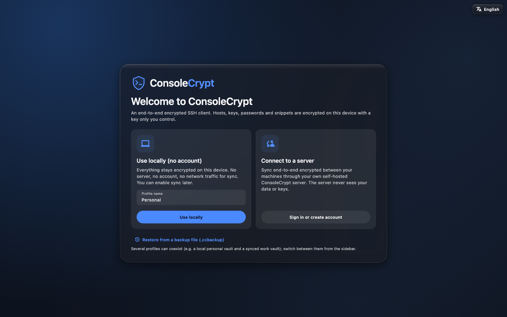

First launch: local use, server connection and restoring a backup.

<a name="linux-install"></a>

## 2. Linux installation: DEB, RPM and keyring

The client targets x86-64 (x64) graphical desktops: Ubuntu 22.04, Debian 12 and Fedora 43. Choose the package for your distribution; the package manager checks dependencies.

1. On Downloads, choose DEB for Ubuntu/Debian or RPM for Fedora. Check the supported system versions and architecture in the release notes, then compare the file’s SHA-256 with the published checksum.

2. Open a terminal in the folder containing the downloaded package. Replace consolecrypt.deb or consolecrypt.rpm below with your exact filename; run only the command for your package format.

3. After installation, open ConsoleCrypt from your application menu in your normal desktop session. Do not run the client with sudo: its keys and settings belong to your user.

4. Device keys require a running, unlocked system keyring with Secret Service, such as GNOME Keyring. Create and unlock the default keyring using your desktop tools before starting the client. The keyring password is separate from your ConsoleCrypt account password and vault passphrase.

5. Linux updates are installed manually: download the new DEB or RPM from Downloads and install it in the same way. Before updating, save an encrypted backup and finish important SSH sessions; keep your vault and keyring.

### Ubuntu / Debian — DEB package

The filename is an example. apt installs the local package and available dependencies from your configured repositories.

```text
sudo apt install ./consolecrypt.deb
```

### Fedora — RPM package

The filename is an example. dnf installs the local package and checks dependencies. Keep these checks enabled.

```text
sudo dnf install ./consolecrypt.rpm
```

> **Keep in mind**
>
> If Secret Service is unavailable or the keyring is locked, resolve its state in your desktop settings and retry. The client does not fall back to storing keys in a plain file. Do not delete your keyring to clear an error: doing so can remove this device’s access.

<a name="passwords"></a>

## 3. Which password do I need?

ConsoleCrypt has separate access layers. Resetting your account password by email does not unlock the encrypted vault.

| What | Purpose |
| --- | --- |
| Account password | Signing in to the server and website account; it can be reset by email. |
| Vault passphrase | Decrypting data on your device. The server does not know it. |
| Recovery Kit | Recovering vault access after losing the passphrase. |
| macOS Keychain password | System permission to access a device key; usually your Mac user account password. |
| SSH password or key | Signing in to a remote host, separate from the sync server. |

1. If macOS asks for access to the login Keychain after a new build, check the application name and use that Keychain’s password. A changed app signature may require renewed permission.

2. After a Mac account password change, the Keychain may still use its previous password. Check it in Keychain Access without deleting ConsoleCrypt keys.

> **Keep in mind**
>
> Do not reset the Keychain just to remove a prompt: doing so may delete device keys. Preserve your Recovery Kit and an encrypted backup first.

<a name="vault"></a>

## 4. Vault, recovery and biometrics

Your vault unlocks on your device. Configure locking and unlocking after creating it.

1. Save the Recovery Kit offline and complete the word check. Its words and QR code grant vault access: do not send them by email, chat or AI.

2. In “Settings → Vault”, select the auto-lock interval. “Lock now” locks the vault; “Change passphrase…” changes the vault passphrase.

3. On a supported device, enable fingerprint unlocking or the option named after the system method. First unlock the vault and approve the device; configure biometrics in system settings.

4. If the kit is lost while the vault is still unlocked, create and save a “New Recovery Kit…”. The previous kit will stop working.

> **Keep in mind**
>
> Biometric unlocking is a local preference and does not sync. Availability depends on hardware and OS; the system dialog may offer your device password. Face ID on a physical iPhone still needs separate verification.

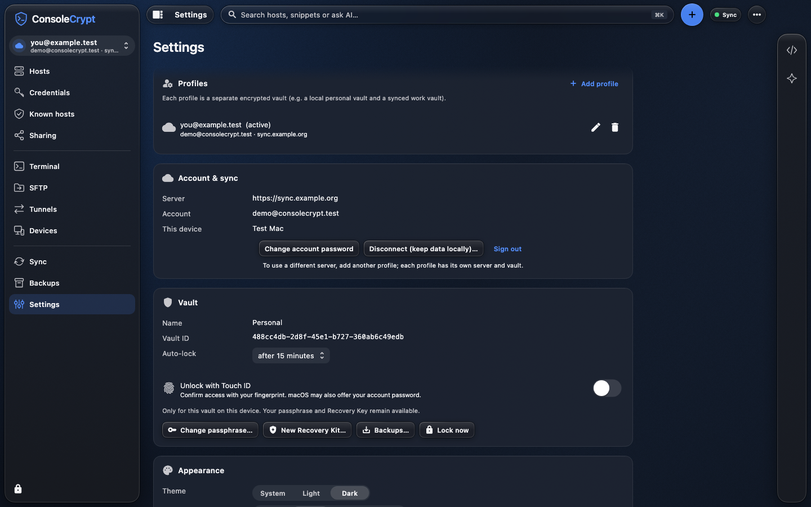

Vault settings and available unlock methods; no secrets are revealed.

<a name="devices"></a>

## 5. Sync and trusted devices

Signing in and being allowed to decrypt the vault are separate actions. A new device needs approval.

1. On the second device, select the same server and account. When approval is required, open “Devices” on an already trusted device.

2. Select the pending device, choose “Verify and approve” and compare the entire displayed code on both devices through an independent channel.

3. In “Synchronization”, check the connection, pending changes and conflicts. Offline changes remain local and are sent when connectivity returns.

4. Revoke a lost device in the client or website account. Reconnecting it requires a new approval.

> **Keep in mind**
>
> Revocation ends sessions and future sync, but cannot erase previously read data or change SSH-server passwords. After a compromise, replace the affected passwords and keys on the hosts themselves.

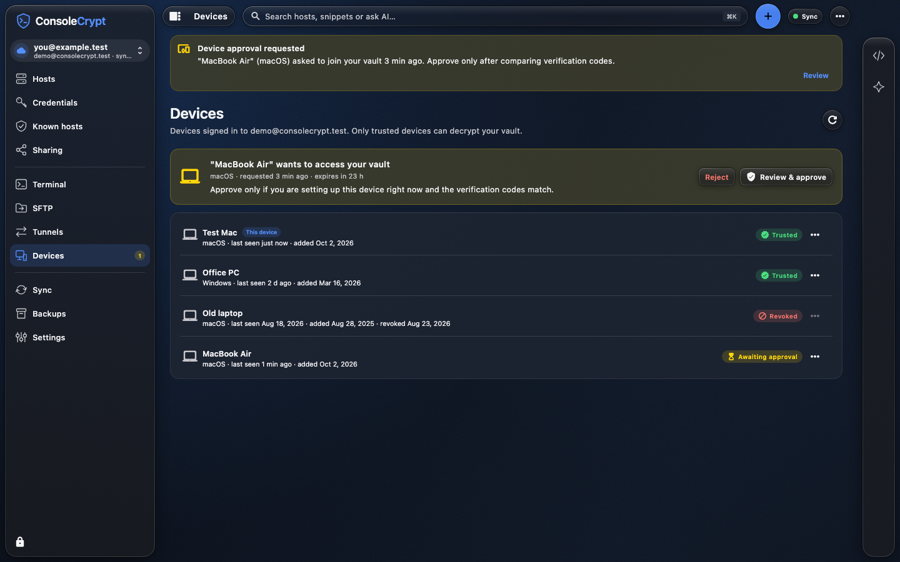

Demo device list; access approval is a separate step.

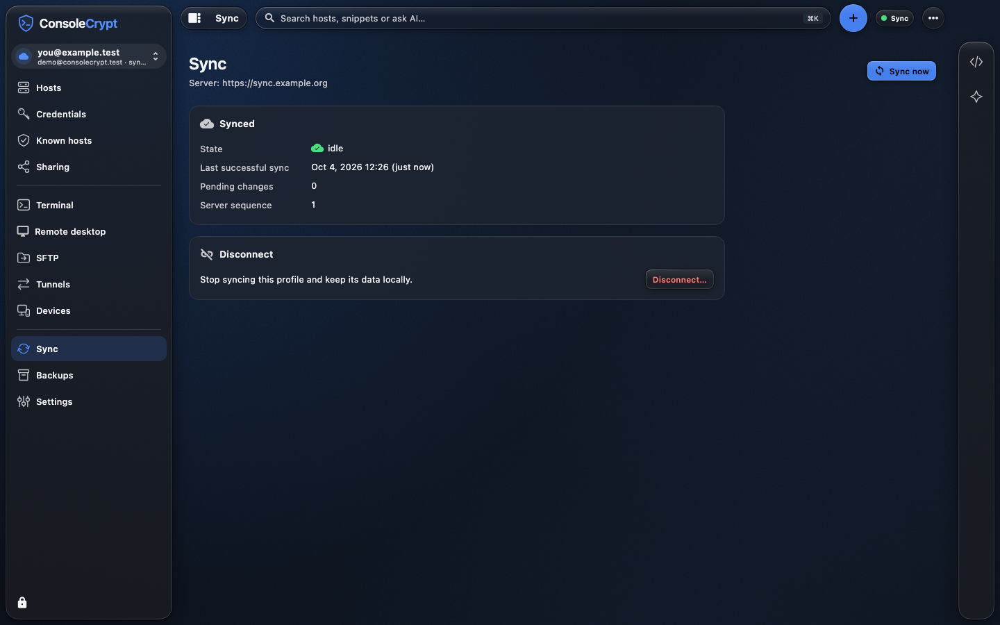

Sync status and queue for the demo profile.

<a name="hosts"></a>

## 6. Hosts: add, find and connect

A host stores SSH or RDP connection settings. Cards and list rows show its address, user and group.

1. Open “Hosts → New host” and first choose SSH or RDP. Enter a name, address, port, username and credential. SSH supports group defaults and jump hosts; RDP uses a password, an optional Windows domain and port 3389 by default.

2. Search names, addresses, groups and tags. The grid/list toggle changes the view; opening a group card shows its contents.

3. Click the centre of a host card or its connect icon. A terminal or remote desktop tab opens according to the connection type.

4. The “…” menu offers connection, SFTP, editing, deletion and adding to an existing group. Sharing appears when supported by the server.

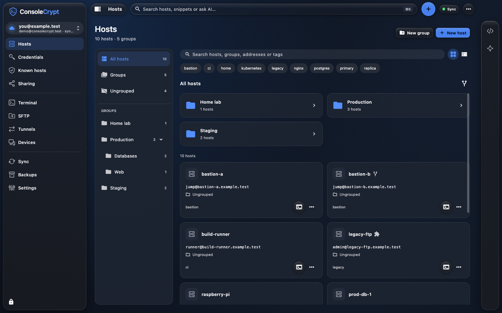

An overview of demo hosts and their connection details.

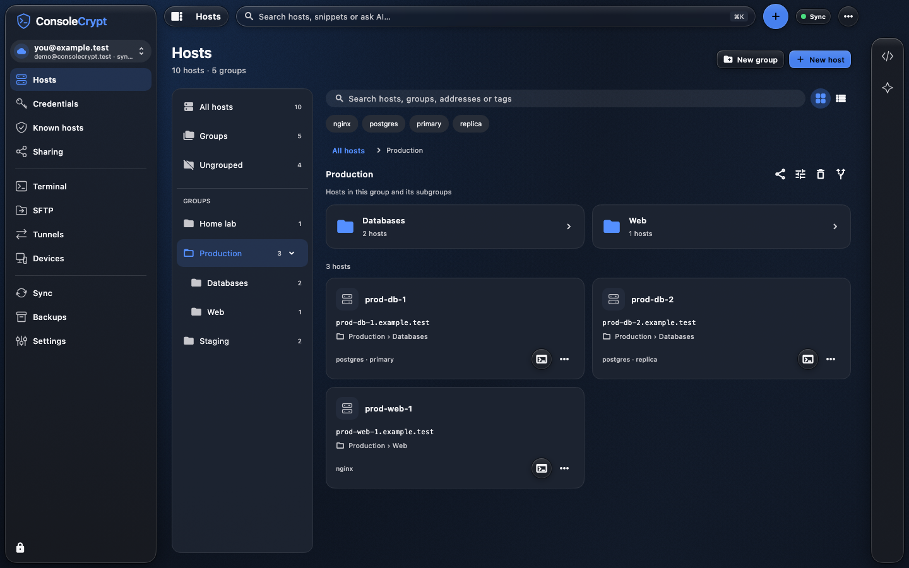

Hosts in a demo group: cards, search and connection actions.

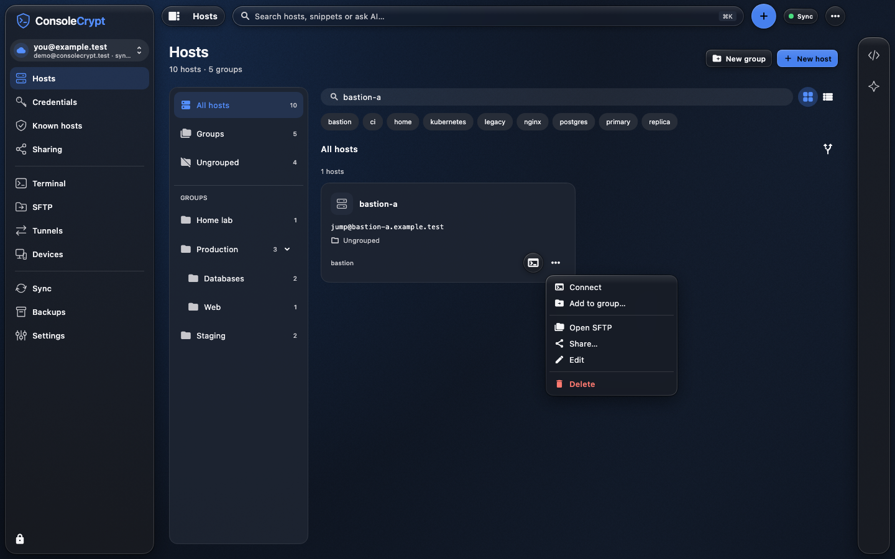

The selected host’s action menu.

<a name="rdp"></a>

## 7. RDP: Windows remote desktop

ConsoleCrypt now supports RDP connections. It connects directly to a standard Microsoft RDP server; no IronRDP add-on needs to be installed on Windows.

1. In “Hosts”, create an RDP connection. Enter the address, Windows username, password and optional domain. Save the password in the encrypted vault or enter it for each connection. SSH group defaults do not apply to RDP.

2. Before connecting, review the address, account and certificate fingerprint. Compare the fingerprint with the server administrator. Changed host details require a fresh confirmation.

3. Under “Remote desktop”, use the central connection button or the “+” beside the tabs to choose a saved RDP host. Open desktops appear in the tab strip. Switch between them, open new sessions and close sessions you no longer need. Up to four RDP sessions can run at once.

4. Click “Full screen” to use the entire screen. Reveal the top connection bar by moving to the blue indicator at the top edge or pressing Ctrl+Alt+Home. Pin the bar if needed. It lets you switch sessions, manage permissions, minimize the window, restore its previous size or disconnect the current session. Escape is sent to the remote computer.

5. Enable text clipboard access for the selected session. Ctrl+V (⌘V on macOS) in the active desktop now sends and pastes local text into Windows without first clicking “Send”. With sharing disabled, Ctrl+V uses the remote Windows clipboard only.

6. “Send” offers text without pasting, while “Receive” requests text from Windows. Changing the local clipboard alone does not send anything. Text up to 64 KiB is supported; images and files are not transferred through the clipboard.

7. On macOS, Windows and Linux, select one local folder in session permissions. Wait for “Folder connected”, then open ConsoleCrypt under redirected drives in Windows File Explorer. Access is read-only by default; enable writing separately. Other local folders and drives are not shared.

8. If the folder is unavailable, check the Windows server drive-redirection policy. The desktop remains usable independently of folder access. Replacing the folder interrupts operations on previously opened files.

9. File exchange supports files up to 256 MiB and up to 512 MiB of attempted writes per session. Reconnect after reaching the limit. Symbolic links, original timestamps and file locks are not transferred.

10. Turn off folder or clipboard access in the session panel when finished. Locking the vault or signing out closes connections and revokes temporary permissions.

> **Keep in mind**
>
> Before creating RDP hosts, update every workspace device to version 0.3 or later. Older clients cannot see RDP hosts but can change their related credentials and groups. RDP hosts sync between your devices running a current client. Sharing RDP hosts with colleagues is not available yet. Folder redirection is unavailable on mobile. Clipboard and drive availability also depends on Windows server policy.

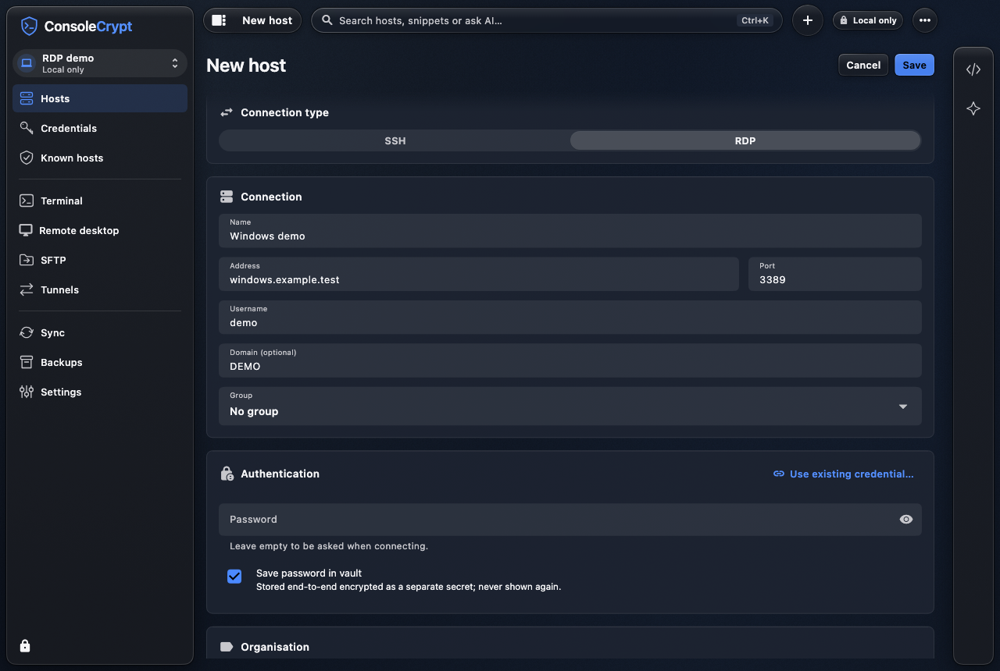

Creating an RDP host: Windows-specific fields and saving its password in the vault. Demo data.

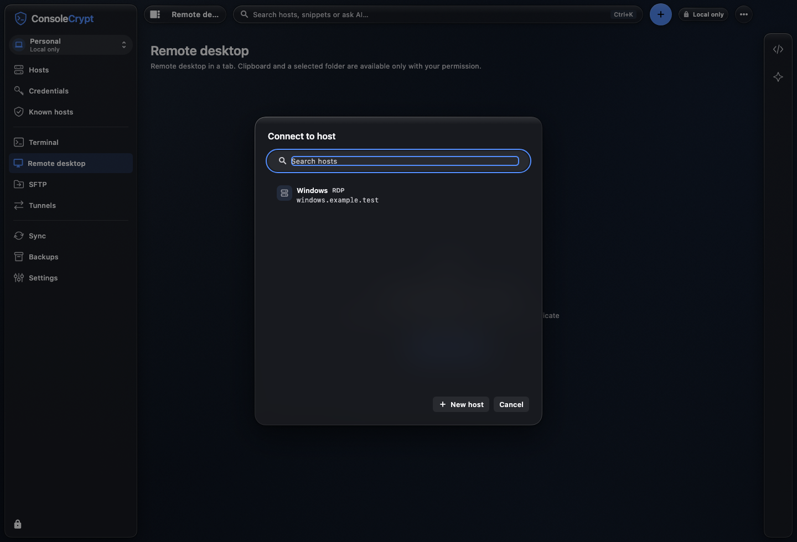

Choosing a saved RDP host from Remote desktop.

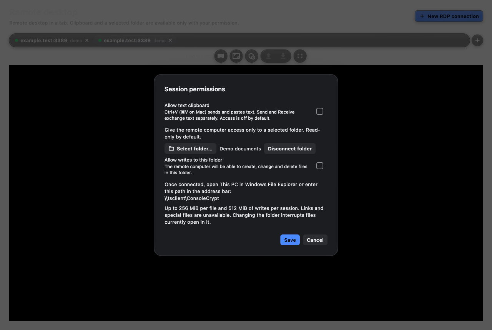

Demo session permissions: text clipboard and a selected folder with a separate write permission. The Windows desktop is not shown.


Full-screen connection bar: session switching, permissions and window controls. Demo data.

<a name="quick-connect"></a>

## 8. Quick search and connect

Find a saved host from anywhere in the app and open an SSH or RDP session. The command palette brings together hosts, snippets and quick actions.

1. In the top bar, the round “+” button opens your saved SSH and RDP hosts. Find a host by name or address and select it to connect. If it is not saved yet, click “New host”. Search fills the available space between the section title and the “+” button; the compact “Sync” status appears on the right.

2. Press ⌘K on macOS or Ctrl+K on Windows/Linux. Type a host name or IP address; search also matches the address and username shown in its connection label.

3. Look in the Hosts group. The connection details appear below each name: check the address, username and port before choosing.

4. Choose a result with ↑ and ↓, then press Enter or click its row. The app opens an SSH terminal or RDP session according to the host type. On the first connection, verify the SSH host key or RDP certificate.

5. Esc closes the palette. If a host is not found, add it in Hosts and search again.

> **Keep in mind**
>
> Saved-host search runs locally. If the entered name or IP address is not found, Enter does not send an AI request. To use AI, explicitly click its row or select it with the arrow keys and confirm. Typing an address does not create a new host.

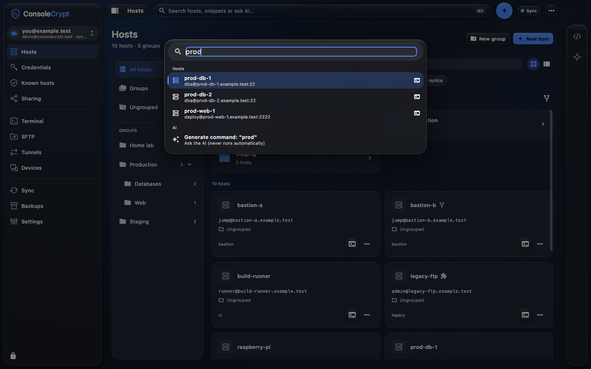

Local search for saved hosts in the command palette.

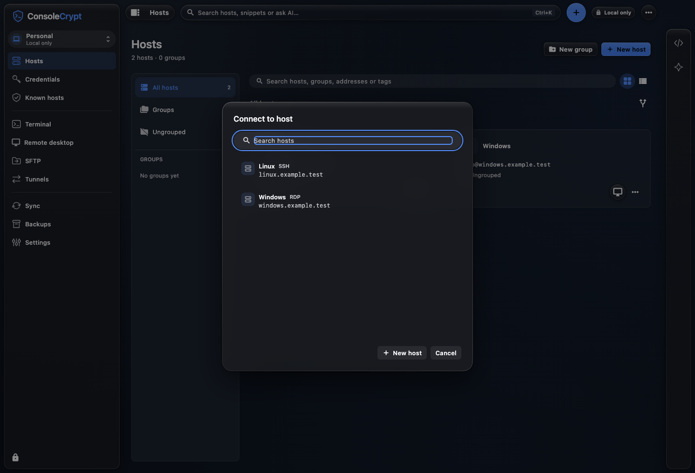

The global “+”: choosing saved SSH and RDP hosts.

<a name="groups"></a>

## 9. Groups and jump hosts

Groups organize your inventory and provide common settings. A jump-host chain reaches an SSH host through intermediate machines.

1. Open “Hosts” in the left menu and click “New group”. Hosts and groups share one inventory; use nested groups for environments and projects.

2. Set a group’s common username, port, credential and jump-host profile. A value set directly on a host overrides inheritance.

3. Create a jump-host profile and choose existing hosts in the required order. Assign the profile to a group or individual host.

4. Before moving or deleting a group, check the resulting inherited settings: changing its parent can change the connection.

> **Keep in mind**
>
> The client establishes SSH connections directly, including jump hosts. The sync server never relays SSH traffic. A private group and a shared collection are different objects; shared collections are explained below.

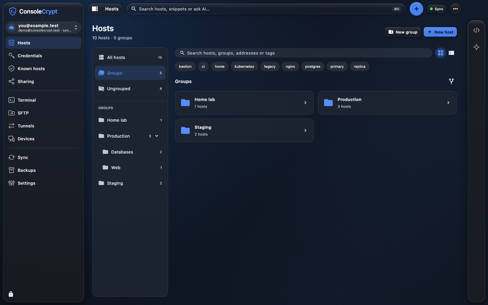

Demo group inventory and workspace navigation.

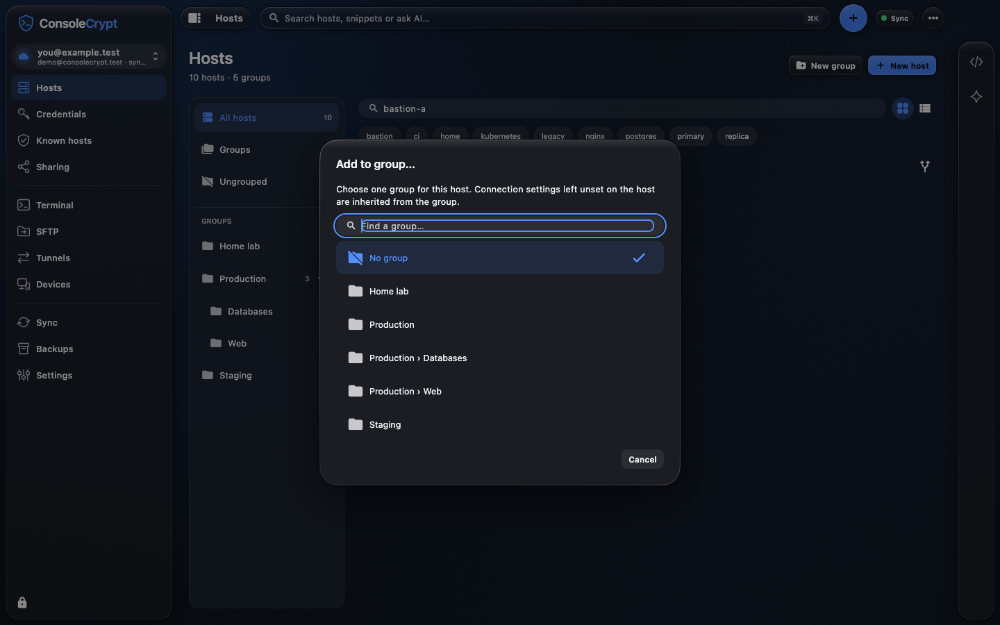

Adding a demo host to an existing group.

<a name="credentials"></a>

## 10. Passwords, keys and credentials

Credentials are separate from hosts: one credential can be assigned to multiple connections.

1. In “Credentials → New credential”, add a password, generate an SSH key or import a supported key. Available agents and hardware methods depend on the platform.

2. Use a descriptive name. Assign the credential to a host or group; enter a key passphrase separately when required.

3. Open its card for metadata and the public key. A secret is revealed only after an explicit action; handle clipboard copies carefully.

4. A copied secret is cleared after the selected timeout if the clipboard has not been replaced with another value. Changing the setting affects future copies. An app crash or system clipboard history can prevent removal.

> **Keep in mind**
>
> Do not put a password or private key into a host name, note or snippet. Use the separate protected sharing workflow to share a secret with a colleague, rather than AI chat.

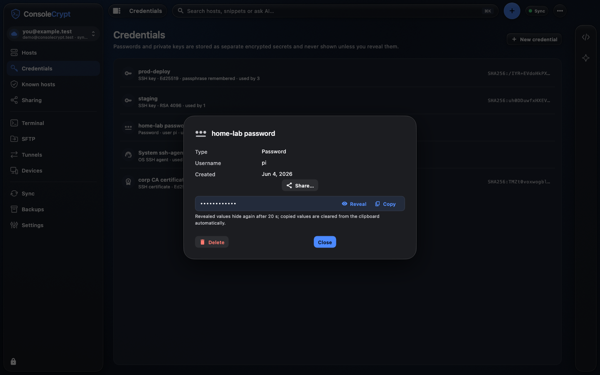

Credentials in a demo vault; values are masked.

<a name="host-keys"></a>

## 11. Known hosts and SSH-key verification

A server key identifies the SSH host you are connecting to. This is separate from trusting a ConsoleCrypt device.

1. On first connection, compare the key fingerprint with the administrator or another trusted source before accepting it.

2. Saved keys appear in the separate “Known hosts” sidebar section. Check the address, algorithm and fingerprint.

3. If the key changes, connection is blocked. Establish the reason first; remove the old entry only after independently verifying the new key.

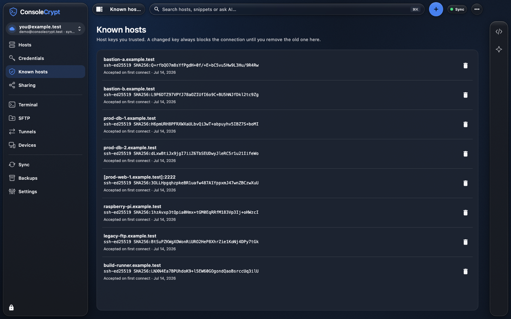

A separate known-host list with demo fingerprints.

<a name="terminal"></a>

## 12. Terminal, tabs and selection

Each tab is an SSH connection. Phones have a special-key bar; computers have shortcuts and a context menu.

1. Click inside the terminal to type. The “+” button opens another connection. When tabs overflow, scroll the strip with the mouse wheel or its edge arrows. The total number of open tabs appears in parentheses beside the arrows.

2. To select several screens of output, hold the mouse button and scroll the history with the wheel. Move the pointer beyond the terminal’s top or bottom edge to scroll automatically while extending the selection.

3. Select text and right-click for the menu. It offers Copy, Paste, Select all, Ask AI and saving the selection as a snippet. Shift+F10 opens it from the keyboard.

4. On a phone, use the keyboard icon and “…” below the terminal. Esc, Tab, Ctrl+C, Ctrl+D, Ctrl+L and arrows are also available in the scrollable bar.

5. Multiline paste and control characters require review. Check the target and text before confirming; execution remains your action.

6. After a disconnect, use reconnect in the tab’s banner. The output buffer stays until the tab closes; closing ends that session.

> **Keep in mind**
>
> Open a new SSH session after updating. Built-in SSH requests UTF-8 for entering and deleting Cyrillic text. If characters are still corrupted, check the remote host’s UTF-8 locale: its shell and SSH-server settings can override the client’s request.

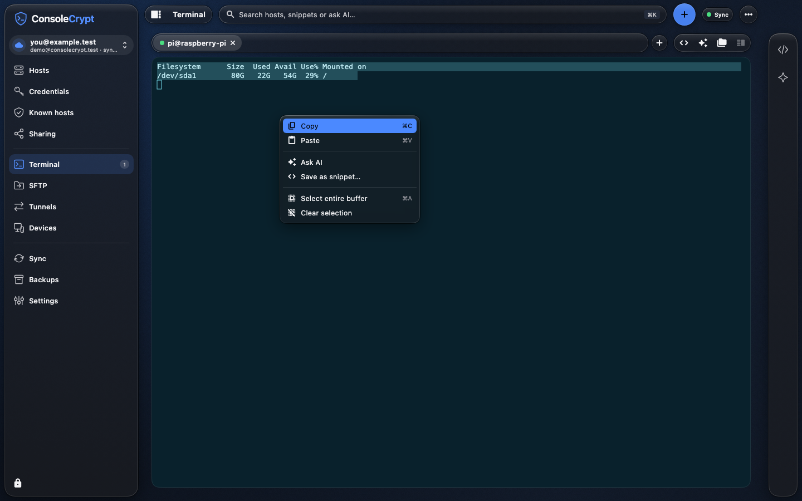

Context menu over a selection in the demo terminal.

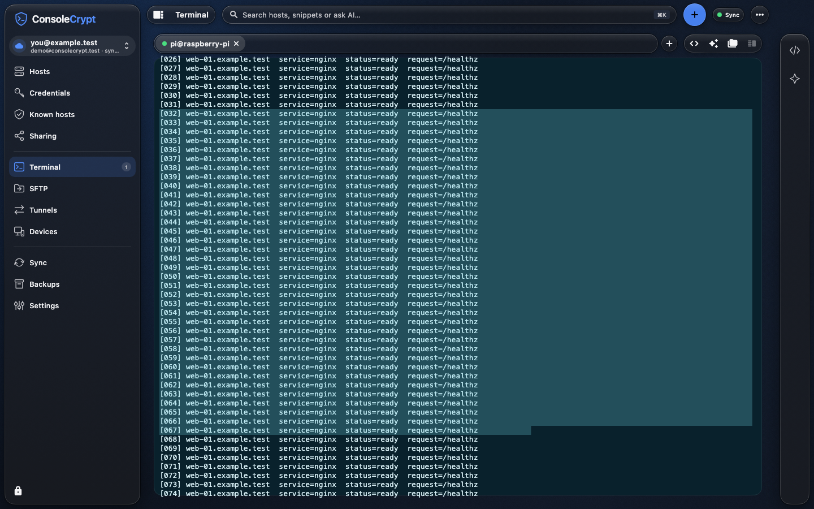

Text selected in the middle of the demo terminal’s scrollback history.

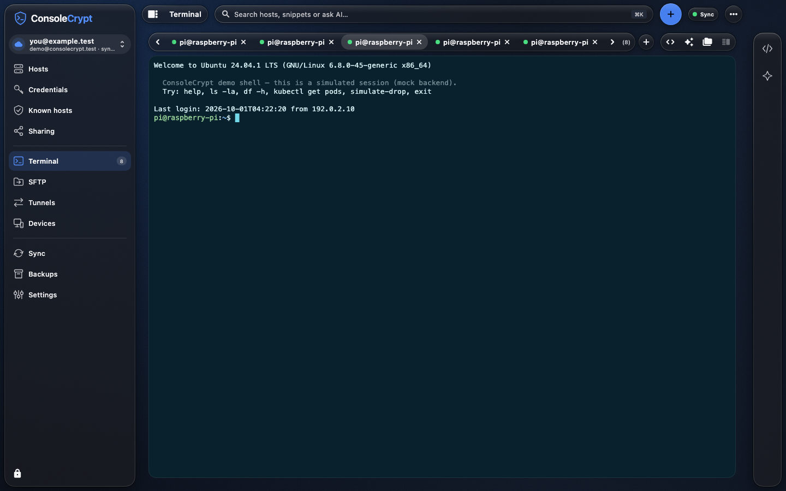

Eight open demo tabs: strip navigation and the tab count.

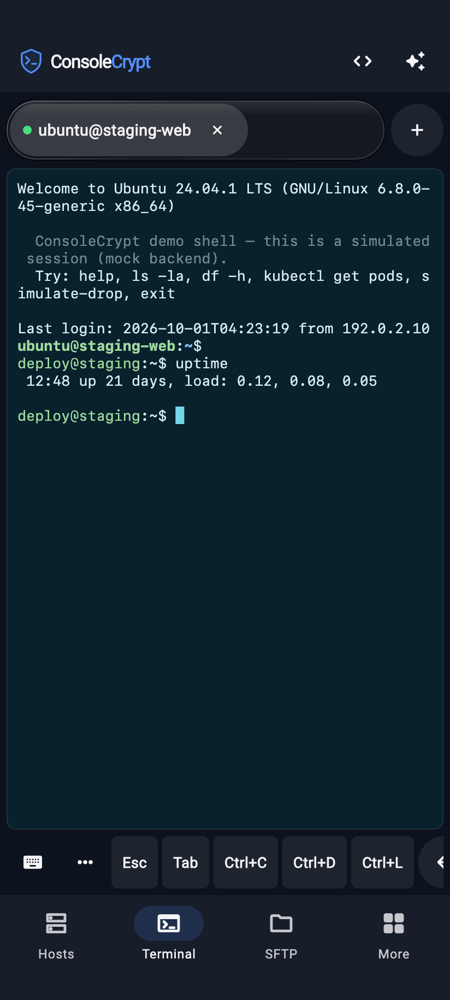

Demo Android terminal with its special-key bar.

<a name="shortcuts"></a>

## 13. Keyboard shortcuts

The main modifier is ⌘ on macOS and Ctrl on Windows/Linux. Copy on Windows does not use Ctrl+C, which interrupts a command.

| Action | macOS | Windows / Linux |
| --- | --- | --- |
| Find a host, snippet or action | ⌘K | Ctrl+K |
| New SSH tab | ⌘T | Ctrl+T |
| Close active tab | ⌘W | Ctrl+W |
| New host | ⌘N | Ctrl+N |
| Lock vault | ⌘L | Ctrl+L |
| Settings | ⌘, | Ctrl+, |
| Snippets | ⌘. | Ctrl+. |
| Copy in terminal | ⌘C | Ctrl+Shift+C |
| Paste in terminal | ⌘V | Ctrl+V; also Shift+Insert on Windows |

> **Keep in mind**
>
> Application shortcuts take priority over terminal input. To send Ctrl+L to the remote shell on a phone, use its special-key button.

<a name="sftp"></a>

## 14. SFTP: transfers and file preview

Open SFTP from a host’s menu or the sidebar. Files travel directly between your device and the SSH host.

1. Select a host and connect. On a computer, use the local and remote panes; on a phone, switch areas and use the system file picker.

2. Select a file and choose upload or download. The activity panel shows transfer progress and cancellation.

3. For reading, open “Quick Look”. Line numbers are in a separate gutter and are excluded from text selection and copying.

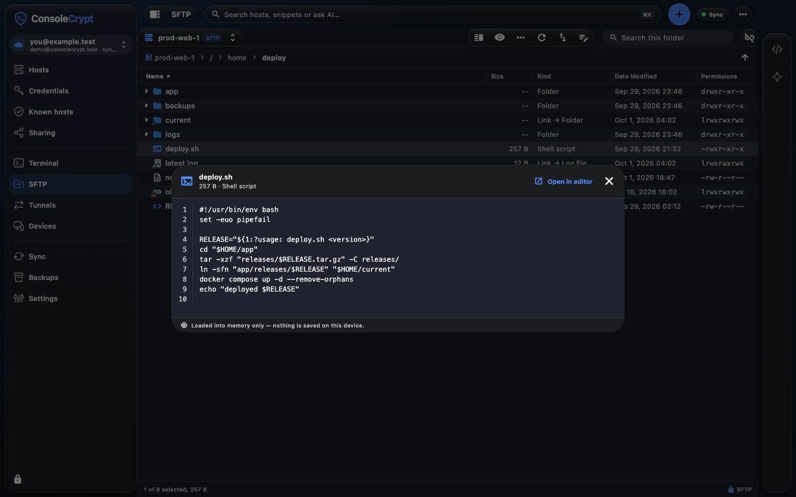

Quick Look for a demo file with a separate line-number gutter.

<a name="sftp-editor"></a>

## 15. SFTP: default editor

On a computer, files can open in an external editor. ConsoleCrypt remembers the chosen application on that device.

1. In “Settings → SFTP → Default editor”, choose “Choose Application” and select an installed VS Code, Zed or another editor.

2. “Open” and “Open in editor” use that choice. “Open with…” selects another application for one file; “System default” resets the preference.

3. Read the first-use notice: a working copy is stored locally, and each save uploads it to the remote server automatically.

4. If another user changes the remote file, resolve the conflict in the editing panel. Stop editing through ConsoleCrypt to complete the upload and remove the working copy.

> **Keep in mind**
>
> External-editor autosave, backups and cloud features are outside ConsoleCrypt’s control. This preference is for desktop systems; mobile file handling depends on system capabilities.

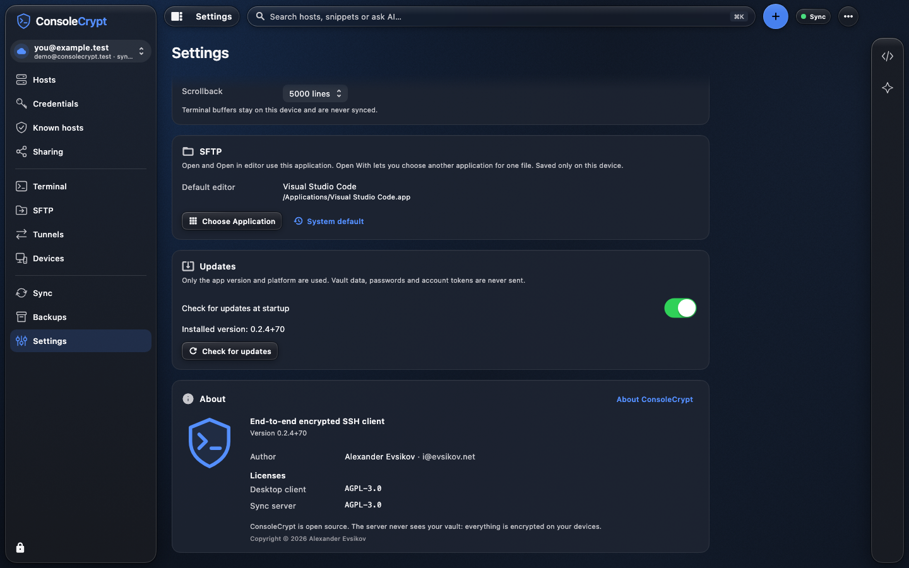

The remembered-editor local preference in the demo client.

<a name="tunnels"></a>

## 16. SSH tunnels

A tunnel uses an SSH connection to the chosen host. Local forwarding, remote forwarding and dynamic SOCKS5 are available.

1. Open “Tunnels” and create one. Select the host, type, listening address and port; for local or remote forwarding, specify a destination address and port.

2. Prefer 127.0.0.1 for a local service needed only by you. Binding to 0.0.0.0 can expose the port to other devices on the network.

3. Start the tunnel and check its status. Stop it when finished.

> **Keep in mind**
>
> A tunnel definition can sync with the vault; a running tunnel belongs to the device where it was started. On phones, background operation depends on OS restrictions.

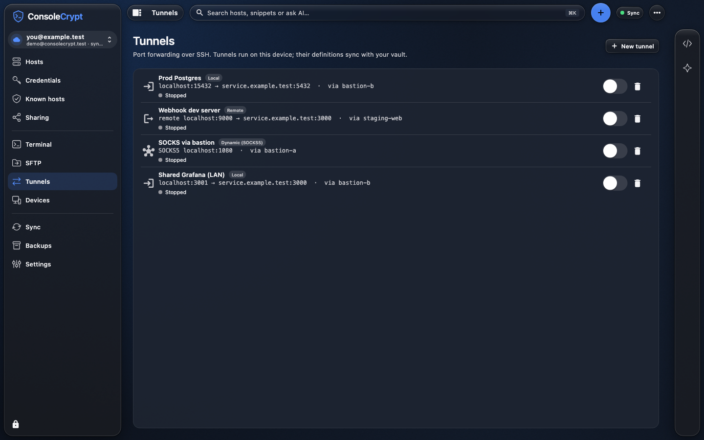

Demo tunnel definitions and statuses.

<a name="snippets"></a>

## 17. Snippets, variables and starter sets

A snippet is a saved command or template. Open the tool with the &lt;/&gt; icon on the right or its shortcut.

1. Choose “New snippet” and enter its name, command, type, tags and optional set. Use variables such as {{service}} in the template.

2. “Starter packages” offers Linux diagnostics, Docker and Kubernetes. Add the sets explicitly; their commands become ordinary vault objects.

3. Edit commands, move them to another set or delete them. Deleting a set deletes its snippets after confirmation and syncs the change; examples do not reappear automatically.

4. Fill variables and inspect the rendered command before using it. “Insert” puts it in the terminal; running on multiple hosts requires choosing targets and a separate confirmation.

> **Keep in mind**
>
> Snippet changes sync in a server-connected profile. They stay local in a local profile. A snippet received from a colleague never executes automatically either.

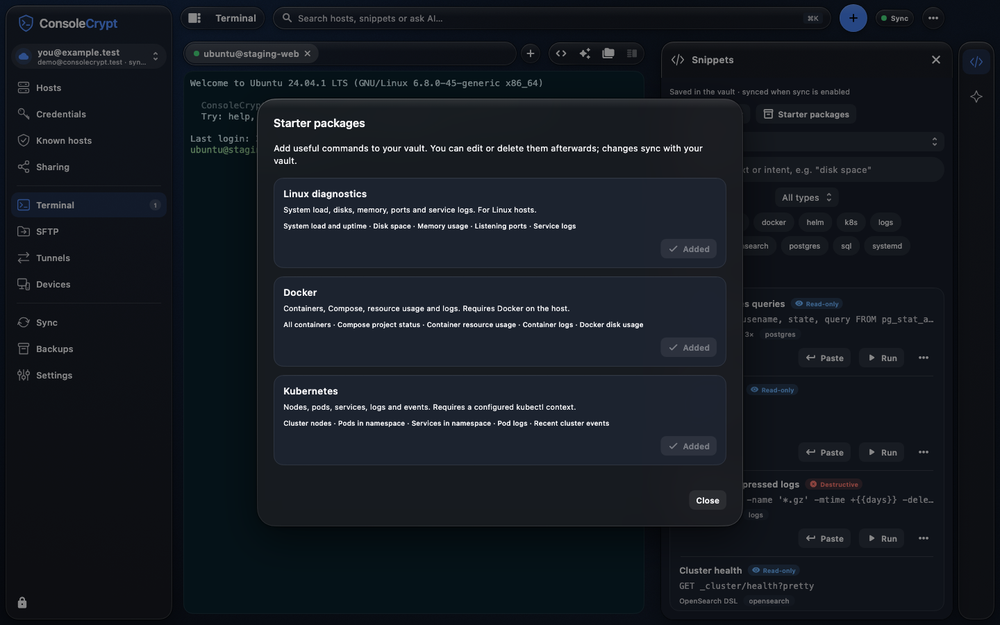

Three starter sets in the real interface with demo data.

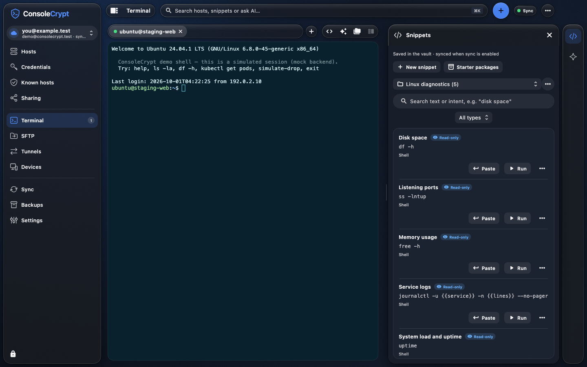

Filtering and managing snippet sets.

<a name="ai"></a>

## 18. AI chat and the context you send

You choose the provider, context and subsequent action. A model’s answer does not execute commands.

1. Add a local or remote provider in AI settings and choose a model. For a remote provider, check its address and data-handling policy.

2. The Strict profile hides secrets, addresses, hostnames, usernames and database names. Standard keeps host metadata; Local provides more context while still hiding secrets.

3. Select the required terminal text and choose “Ask AI”, or enable attaching the selection in chat. Review the context before Send; do not paste secrets into free text.

4. Before “Insert” or “Execute…”, review the proposed command and target host. Execution requires confirmation; assess the command yourself.

> **Keep in mind**
>
> The AI subsystem has no API access to the vault passphrase or private keys. The current chat is held in session memory: do not rely on conversation persistence or sync. Locking the vault or switching profiles clears the chat and cancels the current response; this does not erase context already sent to the provider.

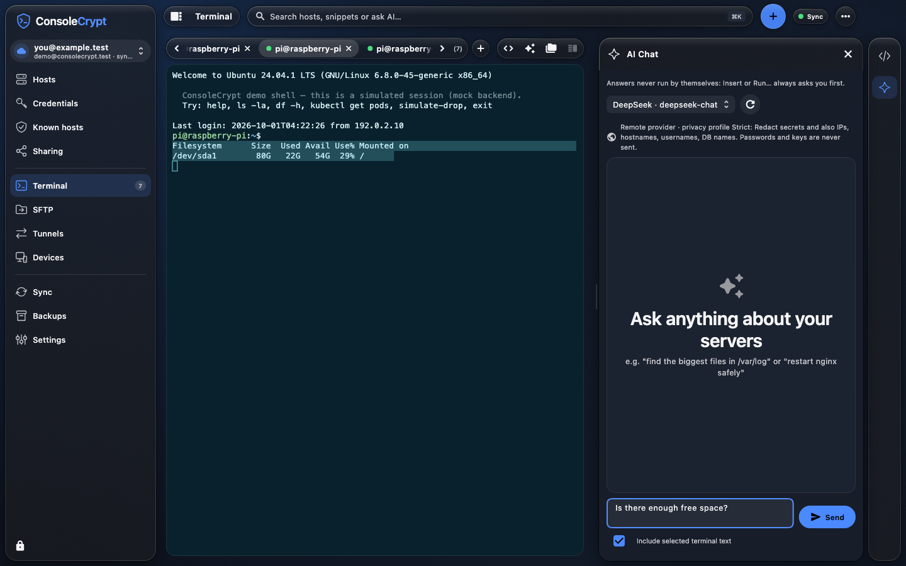

AI chat with selected context from the demo terminal.

<a name="sharing-start"></a>

## 19. Sharing: getting started

Share individual items with verified devices of people on the same server. Your private vault and its key are not shared.

1. Open “Sharing”. “Shared by me” and “Available to me” list created and received items. If unavailable, check server support and configuration.

2. The “Access on another device” card groups adding this device and confirming another. “Device requests” and “More actions” are below; the item-list tabs stay above the card.

3. Choose “Share…” in a host or snippet menu. Review the data: a host is shared without private credentials; pay particular attention to notes.

4. Find your colleague’s devices by email. They open “My device verification code”; compare the whole code through an independent channel and confirm it.

5. Keep “Read” for viewing, or explicitly choose “Edit”. Check recipients and publish. The recipient verifies the owner’s code in “Verify and accept”.

> **Keep in mind**
>
> Availability depends on a compatible server, verified email and device trust. Sharing, groups, secrets and verified enrollment of a colleague’s new devices are enabled on public sync.consolecrypt.dev. Each item is published only through an explicit action by its owner.

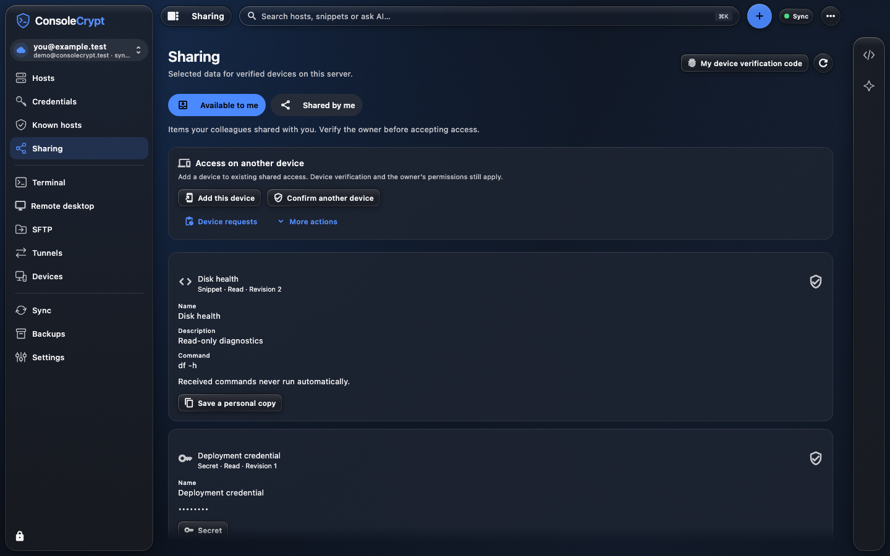

Sharing: a separate device card and synthetic items with a masked secret.

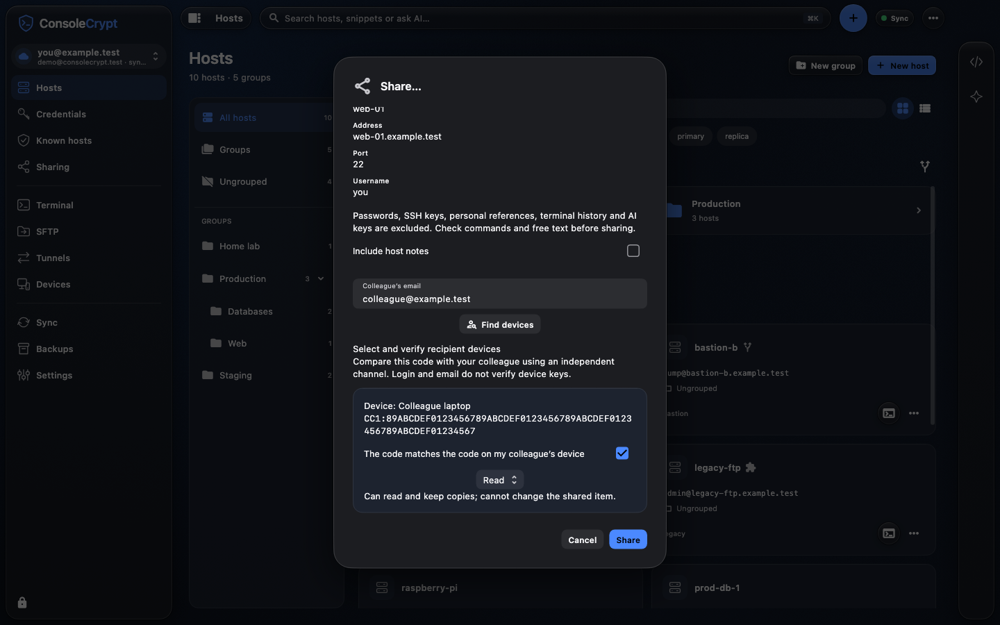

A complete example device code for independent verification; never use the demo code to establish real trust.

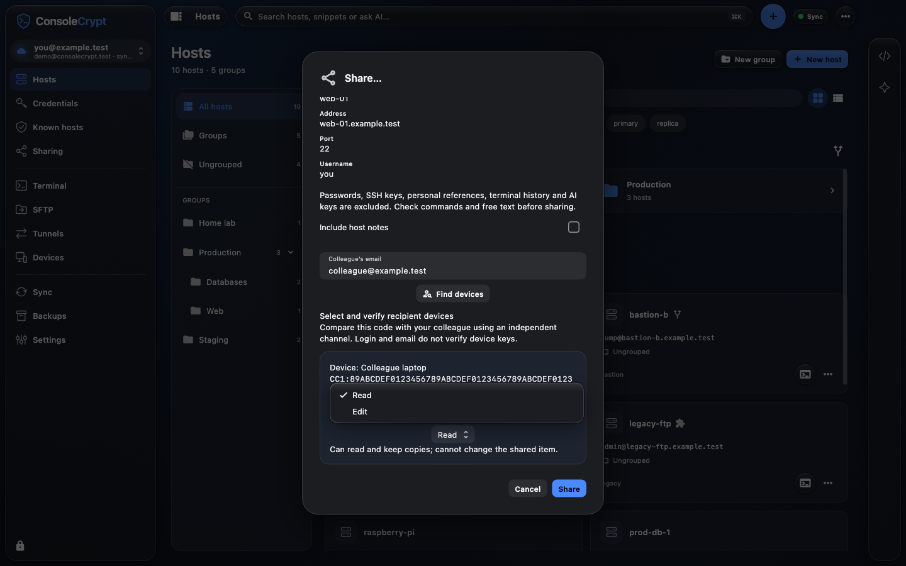

Selecting Reader or Editor access.

<a name="sharing-items"></a>

## 20. Shared hosts, groups and secrets

Each item has its own access rights. A group does not automatically grant access to all its children.

1. For a received host, create a private copy and assign your own credential. A new address or port needs a separate check, including its jump-host chain.

2. When publishing a group, explicitly select references to items already shared independently. Inaccessible children remain locked for the recipient; adding a private host to a group does not publish it.

3. Publish a secret separately from the credential card, with an explicit warning. The main password or key and an SSH-key passphrase are separate items; the masked preview reveals no value.

4. The recipient explicitly reveals or copies the secret after a fresh access check. Revealing is time-limited; locking, switching profiles and closing the dialog remove the revealed value.

> **Keep in mind**
>
> Reader permits viewing and saving accessible data, including a separately shared secret. It cannot prevent copying data that has already been read. Secrets are not put into ordinary host JSON, snippets or AI context.

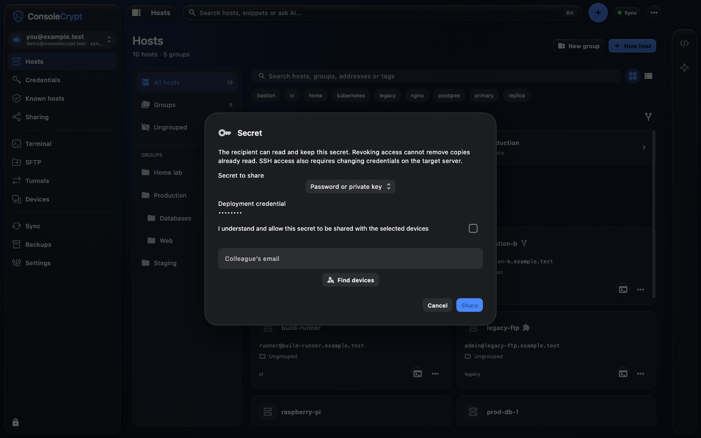

The separate secret-publishing dialog: the value is masked and consent has not been given.

<a name="sharing-devices"></a>

## 21. A colleague’s new personal devices

A grant applies only to new devices belonging to an already verified colleague. It does not invite other people or elevate permissions.

1. The item owner opens “New personal devices” and chooses the colleague’s verified anchor device, role ceiling, expiry and admission limit. Manual approval is the default; Automatic must be explicitly enabled.

2. Forward the public grant package to the new device. Choose “Add this device” in the “Access on another device” card: it inspects the package and creates a request with Reader as the default.

3. On the colleague’s already verified device, choose “Confirm another device”, compare the new device’s entire code and return the endorsed package.

4. The new device continues enrollment and responds to the key-possession challenge through “Device requests”. In Manual mode, the owner approves the request; Automatic acts only within the pre-authorized limits.

> **Keep in mind**
>
> Completing the workflow requires the owner to be online with an unlocked vault. Both modes require full code verification; importing a package alone grants no access. Public packages contain public keys and signatures, not recovery words or private keys.

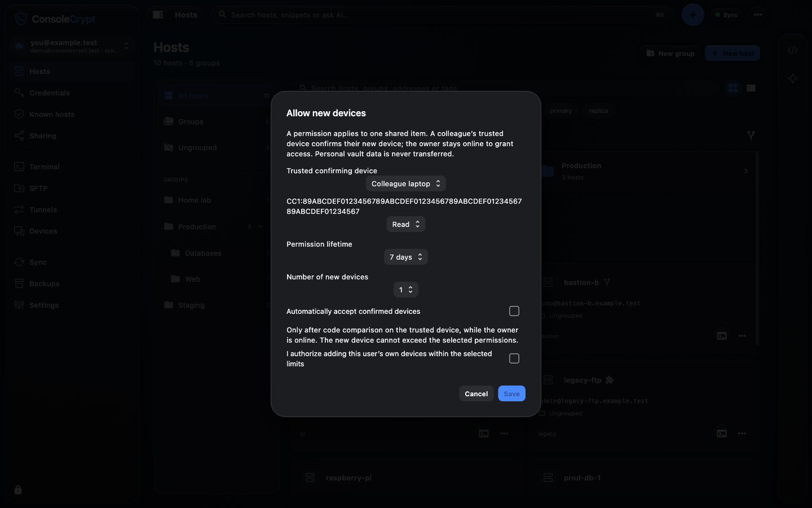

Configuring a new-device grant: Manual approval remains the initial choice.

<a name="sharing-revoke"></a>

## 22. Revocation, queues and trust recovery

The owner manages participants. An editor changes content; participant access remains under the owner’s control.

1. Open an item’s access management and revoke the appropriate device. The key changes for future data; previously read copies remain with the recipient.

2. Revoke the new-device grant to stop future admissions. Devices already admitted must be revoked separately.

3. Check the outgoing queue: pending signed changes can be retried explicitly. Removing a queued operation does not undo a change already published.

4. When warned about stale state, use explicit trust recovery with the owner and the saved public package. Do not delete system keys to bypass the check.

> **Keep in mind**
>
> If a secret may have leaked, revoking access in ConsoleCrypt does not replace changing the password or SSH key on the target server. Neither Manual nor Automatic enrollment erases a recipient’s saved data.

<a name="appearance"></a>

## 23. Colors, text size and glass effects

Appearance preferences are stored on this device. Interface text size and terminal font size are adjusted separately.

1. In “Settings → Appearance”, choose System, Light or Dark and decrease or increase text scale relative to the 100% baseline.

2. Set accent and background using the spectrum or a color value; reset restores the original theme. The terminal section controls its font, size and scrollback buffer.

3. Choose a terminal preset or “Customize / import…”. ConsoleCrypt JSON and iTerm color presets are supported; background, text, cursor, selection and ANSI colors can be adjusted individually.

4. Choose Clear, Default, Tinted or Solid glass. If effects are simplified, check the performance message and system transparency settings.

> **Keep in mind**
>
> Security dialogs stay opaque. System transparency reduction and performance mode can limit glass effects; terminal palette selection is independent of the interface.

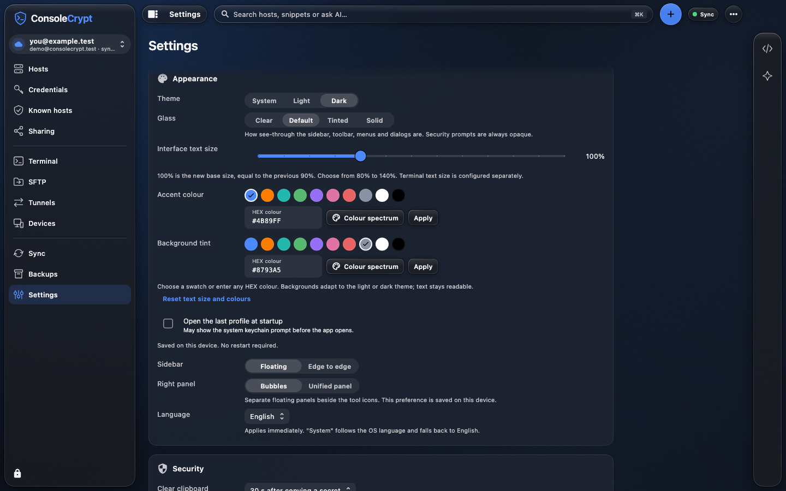

Theme, scale and glass settings in the demo interface.

<a name="right-panel"></a>

## 24. Right panel: bubbles or one workspace

Snippets and AI are in the right-side tool panel. Choose its behavior in appearance settings.

1. Bubbles opens the tool as a separate floating card. The close button dismisses it.

2. Unified panel expands a shared workspace on the right. On a wide display, resize it and continue using the terminal alongside it.

3. When finished with a tool, close it and click inside the active terminal to resume typing. This returns input to the SSH session after using the palette or right-panel fields.

4. Switch between the snippet and AI icons. On a narrow screen, the tool opens over the workspace so its controls remain usable.

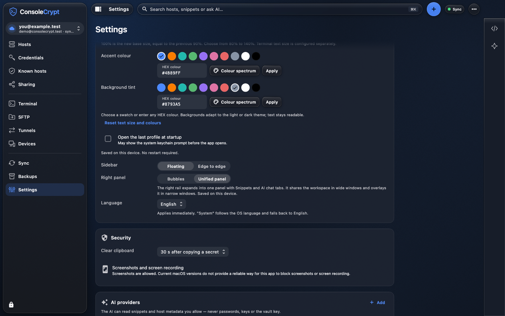

The two right-panel modes in settings.

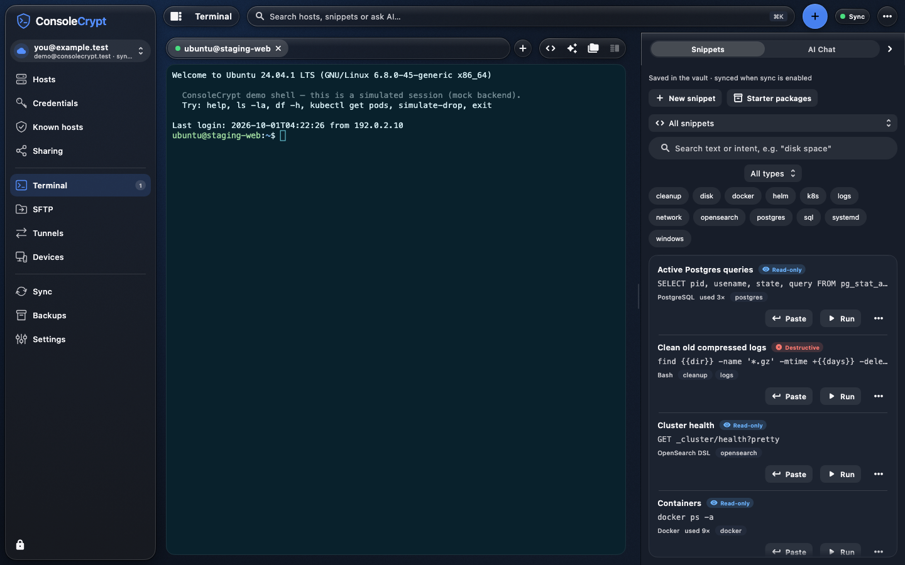

The expanded snippets panel alongside a demo terminal.

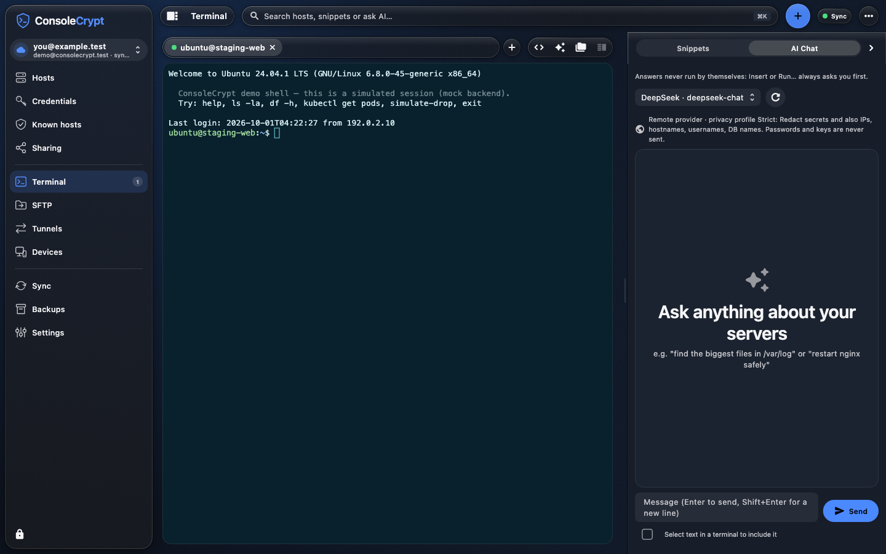

The expanded AI panel alongside a demo terminal.

<a name="screenshots"></a>

## 25. Screenshots and screen protection

Whether an app can block screen capture depends on the OS. Capture preferences are local to the current device.

| Platform | Behavior |
| --- | --- |
| Android | Enable “Allow screenshots” in security settings. Capture is blocked by default; the toggle also affects recording and recent-app previews. |
| macOS | Screenshots are allowed. Modern macOS does not provide a reliable way for an app to block all screenshots and recording; there is no working block toggle. |
| iOS | There is no universal screenshot block. An app-switcher cover protects the preview when backgrounded; physical-iPhone checks remain separate. |

> **Keep in mind**
>
> Do not capture revealed secrets or your Recovery Kit. Every image in this guide uses demo data.

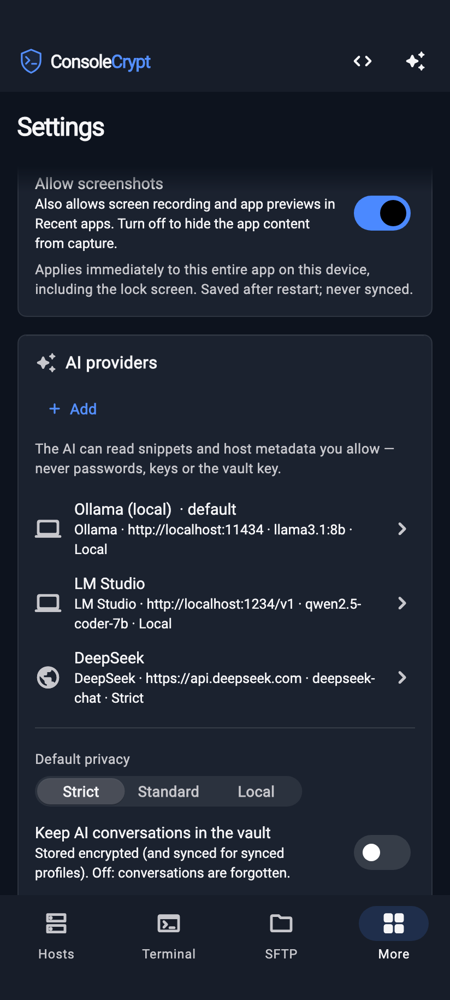

Screenshot permission in the demo Android interface; this shows the UI, not capture enforcement on a physical phone.

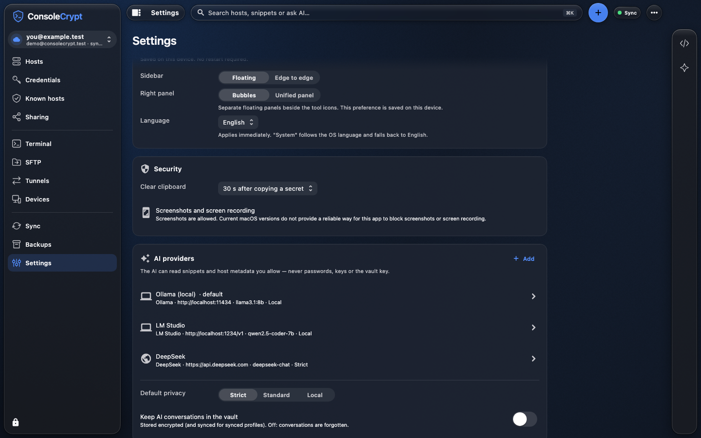

The macOS security section explains the OS limitation.

<a name="backups"></a>

## 26. Backups and restore

Sync does not replace a backup. Keep the encrypted file apart from your device and the Recovery Kit apart from that file.

1. In “Backups”, export the vault as a .ccbackup file. On a computer, configure a folder and automatic-backup schedule; mobile capabilities depend on the system file picker.

2. To restore, choose the file from the welcome screen or backup section. Review its information first.

3. Unlock the backup with its passphrase, or with the Recovery Kit and a new passphrase. Restoring creates a new profile.

> **Keep in mind**
>
> When moving to another server, keep the original profile until you verify the restore. Editor and appearance preferences and terminal scrollback do not become synced vault data.

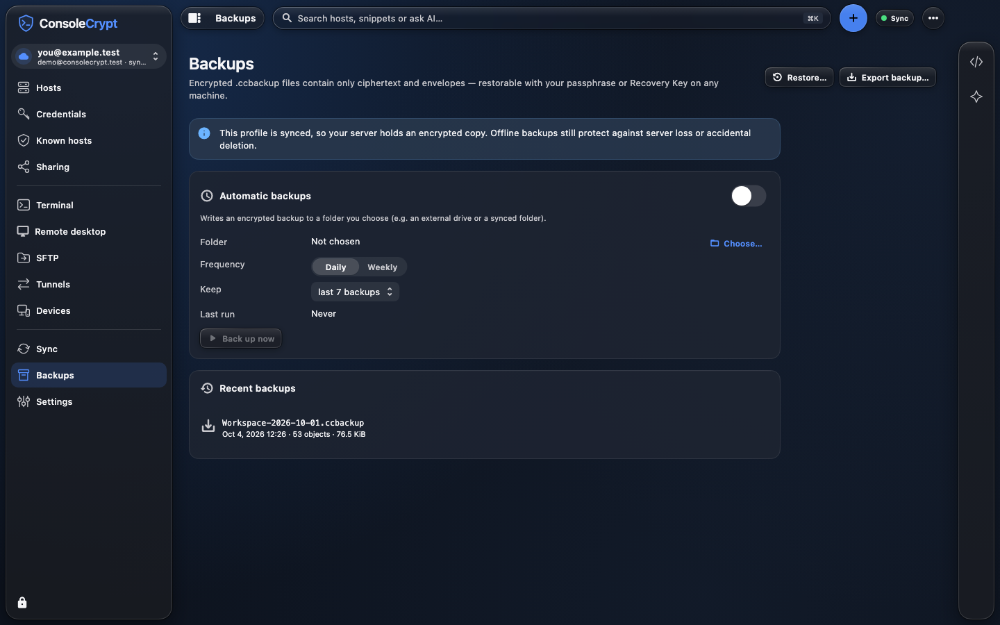

Encrypted backups and scheduling in the demo client.

<a name="about"></a>

## 27. Version, author and licenses

About shows details of the installed app: its version, build number, author and licenses.

1. Open “Settings → About”. On macOS, the same dialog is also available from the ConsoleCrypt app menu.

2. When contacting support, include the version and build number from this dialog along with your operating system. They identify the update you have installed.

3. Client and server licenses are listed separately; both are labelled AGPL-3.0 in the interface. Check for new versions in Updates.

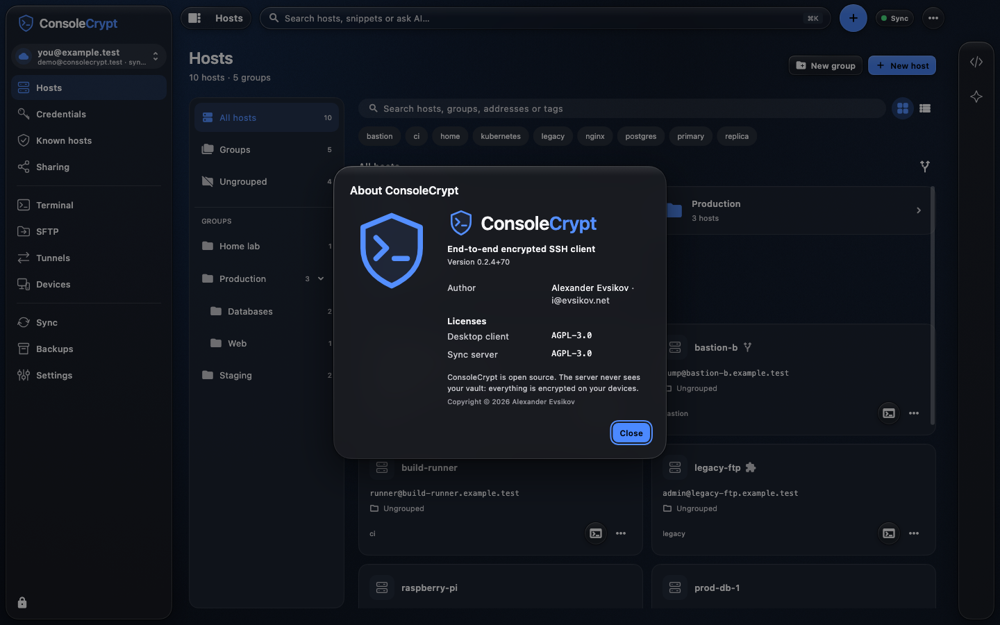

About: version, author and the client and server license labels.

<a name="updates"></a>

## 28. Client updates

On Windows, macOS and Android, “Settings → Updates” offers startup checks and a manual check. A check does not install an update by itself. On Linux, download the new package from the website and install it manually.

1. Turn off automatic checks if you prefer manual checks. Choose “Check for updates” and review the new version and notes.

2. Save a backup and finish important sessions before installation. When downloaded through the app, the package is checked against signed metadata and a checksum; installation requires your action.

3. Windows uses an installer; Android uses the system APK installer.

4. On Linux, download the new DEB or RPM from Downloads and install it manually with your package manager. See the Linux installation chapter for instructions.

5. With ConsoleCrypt 0.2.2 or newer on macOS, choose a new DMG filename or folder in the system “Save and open” dialog after downloading. Once the DMG opens, quit the app, drag the new copy to Applications and confirm replacement.

6. Cancelling the dialog keeps the verified download ready for retry. Choose a new filename when saving: an existing file is never overwritten.

[Full client update instructions ↗](../docs/public/UPDATES.md)

> **Keep in mind**
>
> If ConsoleCrypt cannot open on macOS after an update from the old app, download the latest DMG once through your browser. Quit ConsoleCrypt and replace it in Applications. Downloading again through the old button will not clear the block. Keep your vault and Keychain. After the replaced app starts, later updates use the system “Save and open” dialog.

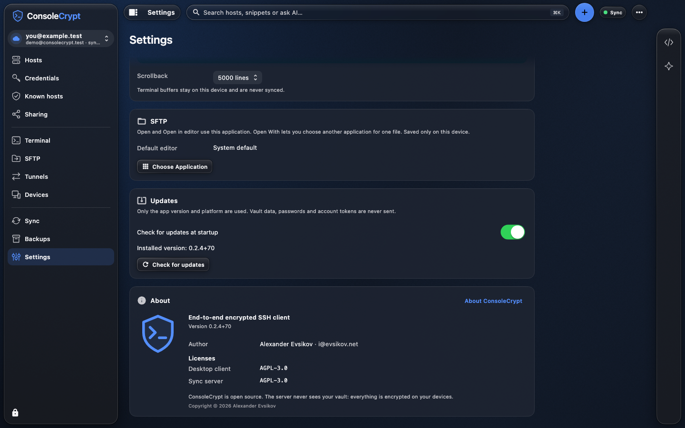

Update checking with a separate startup-check preference.

<a name="server-account"></a>

## 29. Website account

The website account manages your public-server account. Decrypted hosts, keys and snippets remain in the application.

1. Open “Account” and use your public-server email and account password, including existing consolecrypt.evsikov.net accounts. You can verify email, change the account password and revoke devices here.

2. For a private environment, deploy a compatible server from the repository’s server component. Docker and Helm instructions are intended for administrators.

3. Create a client profile using your server’s HTTPS address. Register an account there; the administrator configures email, server backups and sharing availability.

> **Keep in mind**
>
> The server sees accounts and operational metadata, stores encrypted objects and has no decryption key. Signing in to this website does not transfer an account from another server.

<a name="server-setup"></a>

## 30. Your own server: Kubernetes

A server enables device sync and collaboration. The client does not need one for local use. Neither the product website nor analytics is required to run your own server.

1. Prepare Kubernetes, Helm, PostgreSQL 16 and an HTTPS domain. A small installation can use the PostgreSQL bundled with the Helm chart; the full instructions below describe both options.

2. Download the source. Keep kubeconfig, the database password and SMTP password outside the repository. Create a namespace and a Secret containing your PostgreSQL URL from a private file.

3. Copy the example Helm values into a private directory. Configure the image repository and immutable digest, your domain, IngressClass, TLS and existing database Secret. Keep mandatory request signatures enabled.

4. Validate the values with helm lint and install the chart. The example below assumes external PostgreSQL and an already configured TLS Ingress; substitute your own domains and file paths.

5. Check /readyz and /v1/meta. In the client, choose a server connection and enter its base HTTPS address without /v1. Create an account on that server and test sync on a second device.

6. For email, configure SMTP with TLS and a separate Secret. The administrator separately enables sharing for teamwork. Schedule PostgreSQL backups and verify restoration before upgrades.

### 1. Source and database Secret

Example for sh/bash/zsh. The database-url file contains your database connection string; the command reads it without printing its contents.

```text
git clone https://github.com/evsikovas/consolecrypt-server.git
cd consolecrypt-server
kubectl --kubeconfig /private/path/kubeconfig.yaml create namespace consolecrypt
kubectl --kubeconfig /private/path/kubeconfig.yaml -n consolecrypt create secret generic consolecrypt-database \
  --from-file=database-url=/private/path/database-url
```

### 2. Validate and install the Helm chart

Complete your private values.yaml using the full instructions first. The example works with Helm 3 and 4. Back up the database before upgrading: a Helm rollback does not undo migrations.

```text
helm lint server/helm/consolecrypt-server -f /private/path/values.yaml
helm upgrade --install consolecrypt server/helm/consolecrypt-server \
  --namespace consolecrypt \
  --kubeconfig /private/path/kubeconfig.yaml \
  -f /private/path/values.yaml \
  --history-max 10 --wait --timeout 10m
```

### 3. Check the running API

Use your own domain. /readyz confirms database readiness; /v1/meta reports the server version and protocol.

```text
curl --fail https://sync.example.com/readyz
curl --fail https://sync.example.com/v1/meta
```

[Full instructions: Docker, Helm, HTTPS, email and backups ↗](https://github.com/evsikovas/consolecrypt-server/blob/main/docs/public/HOSTING.md)

> **Keep in mind**
>
> Accounts on different servers are independent. The server stores encrypted data and operational metadata, never decrypts your vault and never carries SSH connections. Back up existing vaults before moving them.


Client connection: choose a server or start working locally.


Sync: the connected profile, status and actions for checking data exchange.

<a name="server-docker"></a>

## 31. Your own server: Docker Compose

Run ConsoleCrypt on a single Linux server without Kubernetes: a prebuilt server image, PostgreSQL 16 and Caddy for HTTPS. Database data and certificates are kept in persistent Docker volumes.

1. Prepare an AMD64 or ARM64 Linux server with Docker Engine, Docker Compose v2, Git and Python 3. Point your domain’s DNS at the server and make inbound TCP ports 80 and 443 available for HTTPS.

2. Download the example and run the configuration generator. It creates random database passwords and a private server.env outside the repository, asks for SMTP settings and refuses to overwrite an existing file. Keep this file when upgrading.

3. Validate the configuration and start the https profile. Compose downloads the prebuilt server image and starts PostgreSQL and Caddy. Rust builds and Helm are not required; the server runs database migrations on startup.

4. Check /readyz and /v1/meta through your HTTPS domain. PostgreSQL does not publish a host port; the API’s HTTP port is bound to 127.0.0.1 only. Clients connect through Caddy; do not expose port 8080 to the internet.

5. In the client, choose your own server and enter https://sync.example.com without /v1. Create an account, check email delivery and sync between two devices. The full instructions explain email verification and enabling collaboration.

6. Schedule PostgreSQL backups and test restoration. Before upgrading, save the database, private configuration and current image digest. Restarting containers preserves data; deleting volumes does not.

### 1. Example and private configuration

Commands for a Linux terminal, Bash or zsh. Replace sync.example.com with your domain. The generator requests the SMTP password without displaying it.

```text
git clone --depth 1 https://github.com/evsikovas/consolecrypt-server.git consolecrypt-server-docker
cd consolecrypt-server-docker
export CC_INSTALL_DIR="$HOME/.config/consolecrypt-docker"
export CC_API_DOMAIN="sync.example.com"
python3 server/deploy/docker/init-config.py \
  --directory "$CC_INSTALL_DIR" --domain "$CC_API_DOMAIN"
```

### 2. Start with HTTPS

In the same terminal, define the cc\_compose helper. config --quiet validates the file without printing passwords; Caddy obtains a certificate for your chosen domain.

```text
cc_compose() {
  docker compose --env-file "$CC_INSTALL_DIR/server.env" \
    -f server/deploy/docker/compose.yaml --profile https "$@"
}
cc_compose config --quiet
cc_compose pull
cc_compose up -d --wait --wait-timeout 180
cc_compose ps
```

### 3. Check and connect your client

Expect HTTP 200, ready from /readyz and version JSON from /v1/meta. Use the same domain with https:// in the client. If the certificate is not ready yet, check DNS, ports and Caddy logs using the full instructions.

```text
curl --fail "https://$CC_API_DOMAIN/readyz"
curl --fail "https://$CC_API_DOMAIN/v1/meta"
```

[Full Docker instructions: HTTPS, SMTP, backups and upgrades ↗](https://github.com/evsikovas/consolecrypt-server/blob/main/docs/public/HOSTING.md#docker-compose)

[SMTP settings and installation without Docker: private configuration file ↗](https://github.com/evsikovas/consolecrypt-server/blob/main/server/deploy/native/README.md)

> **Keep in mind**
>
> This Compose setup runs the sync server. It never decrypts vaults or carries SSH traffic. The private server.env contains passwords: do not publish it or attach it to reports. Do not run the generator again for an existing database. To change SMTP settings, edit server.env and recreate the server container; no image rebuild is needed.


Choose your own server in the client and enter its HTTPS address.
