# Руководство ConsoleCrypt

[English](en.md) · [README](../README.md) · [Сайт](https://consolecrypt.evsikov.net/guide?lang=ru)

Пошаговое руководство с реальным интерфейсом приложения и демонстрационными данными. Снимки не содержат пользовательских секретов. Версии исходных снимков указаны в [манифесте](../assets/guide/manifest.json).

## Оглавление

**Начало работы**

- [Первый запуск и профили](#first-start)
- [Установка Linux: DEB, RPM и связка ключей](#linux-install)
- [Какой пароль нужен?](#passwords)
- [Хранилище, восстановление и биометрия](#vault)
- [Синхронизация и доверенные устройства](#devices)

**Рабочее пространство**

- [Хосты: добавить, найти, подключиться](#hosts)
- [RDP: удалённый рабочий стол Windows](#rdp)
- [Быстрый поиск и подключение](#quick-connect)
- [Группы и jump-хосты](#groups)
- [Пароли, ключи и учётные данные](#credentials)
- [Известные хосты и проверка SSH-ключа](#host-keys)
- [Терминал, вкладки и выделение](#terminal)
- [Горячие клавиши](#shortcuts)
- [SFTP: передача и просмотр файлов](#sftp)
- [SFTP: редактор по умолчанию](#sftp-editor)
- [SSH-туннели](#tunnels)
- [Сниппеты, переменные и базовые наборы](#snippets)
- [ИИ-чат и отправляемый контекст](#ai)

**Совместная работа**

- [Совместный доступ: с чего начать](#sharing-start)
- [Общие хосты, группы и секреты](#sharing-items)
- [Новые собственные устройства коллеги](#sharing-devices)
- [Отзыв, очередь и восстановление доверия](#sharing-revoke)

**Настройки и обслуживание**

- [Цвета, размер текста и эффект стекла](#appearance)
- [Правая панель: пузыри или единая область](#right-panel)
- [Скриншоты и защита экрана](#screenshots)
- [Резервные копии и восстановление](#backups)
- [Версия, автор и лицензии](#about)
- [Обновления клиента](#updates)
- [Личный кабинет](#server-account)
- [Свой сервер: Kubernetes](#server-setup)
- [Свой сервер: Docker Compose](#server-docker)

<a name="first-start"></a>

## 1. Первый запуск и профили

Начните локально или подключите зашифрованную синхронизацию. Профиль объединяет своё хранилище и, при наличии, аккаунт на выбранном сервере.

1. Установите клиент из раздела «Скачать». На macOS перенесите ConsoleCrypt в Applications; на Windows запустите установщик; на Linux установите DEB или RPM по главе «Установка Linux»; на Android подтвердите установку APK в системном диалоге.

2. На macOS и Windows приложение открывается в большом окне, которое подстраивается под доступное место на экране. Измените его размер под свою работу: терминал и боковые инструменты могут оставаться рядом.

3. Для работы без сервера выберите «Работать локально», задайте название профиля и создайте хранилище.

4. Для нескольких устройств выберите «Подключиться к серверу», проверьте HTTPS-адрес и войдите или создайте аккаунт. Подтвердите email, если сервер этого требует.

5. Переключайте профили в верхней части бокового меню. Дополнительные профили и включение синхронизации доступны в настройках; данные разных профилей не смешиваются.

> **Обратите внимание**
>
> Учётные записи принадлежат конкретному серверу. Веб-кабинет этого сайта обслуживает consolecrypt.evsikov.net; аккаунт с другого сервера здесь не появится автоматически.

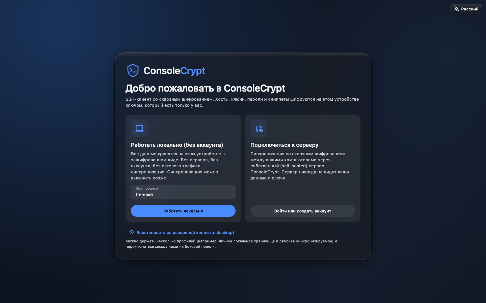

Первый запуск: локальная работа, подключение сервера и восстановление из копии.

<a name="linux-install"></a>

## 2. Установка Linux: DEB, RPM и связка ключей

Клиент предназначен для x86-64 (x64) с графическим рабочим столом: Ubuntu 22.04, Debian 12 и Fedora 43. Выберите пакет своего дистрибутива; пакетный менеджер проверит зависимости.

1. На странице «Скачать» выберите DEB для Ubuntu/Debian или RPM для Fedora. Проверьте поддерживаемые версии системы и архитектуру в описании релиза, затем сравните SHA-256 файла с опубликованной контрольной суммой.

2. Откройте терминал в папке с загруженным пакетом. В примере ниже замените consolecrypt.deb или consolecrypt.rpm точным именем своего файла; выполните только команду для своего формата.

3. После установки запустите ConsoleCrypt из меню приложений в своей обычной графической сессии. Не запускайте клиент через sudo: ключи и настройки принадлежат вашему пользователю.

4. Для ключей устройства нужна работающая и разблокированная системная связка ключей с Secret Service, например GNOME Keyring. Создайте и разблокируйте основную связку средствами рабочего стола до запуска клиента. Пароль связки ключей отличается от пароля аккаунта ConsoleCrypt и парольной фразы хранилища.

5. На Linux обновления устанавливаются вручную: скачайте новый DEB или RPM со страницы «Скачать» и установите тем же способом. Перед обновлением сохраните зашифрованную резервную копию и завершите важные SSH-сессии; хранилище и связку ключей сохраняйте.

### Ubuntu / Debian — пакет DEB

Имя файла — пример. apt устанавливает локальный пакет и доступные зависимости из настроенных репозиториев.

```text
sudo apt install ./consolecrypt.deb
```

### Fedora — пакет RPM

Имя файла — пример. dnf устанавливает локальный пакет и проверяет зависимости. Не отключайте эти проверки.

```text
sudo dnf install ./consolecrypt.rpm
```

> **Обратите внимание**
>
> Если Secret Service недоступен или связка заблокирована, исправьте её состояние в настройках рабочего стола и повторите действие. Клиент не заменяет защищённое хранение ключей записью в обычный файл. Не удаляйте связку ключей ради устранения ошибки: это может лишить устройство доступа.

<a name="passwords"></a>

## 3. Какой пароль нужен?

В ConsoleCrypt есть разные уровни доступа. Сброс пароля аккаунта по почте не открывает зашифрованное хранилище.

| Что | Для чего |
| --- | --- |
| Пароль аккаунта | Вход на сервер и в веб-кабинет; его можно сбросить через email. |
| Парольная фраза хранилища | Расшифровка данных на устройстве. Сервер её не знает. |
| Комплект восстановления | Восстановление доступа к хранилищу при потере парольной фразы. |
| Пароль связки ключей macOS | Системное разрешение доступа к ключу устройства; обычно пароль учётной записи Mac. |
| Пароль или ключ SSH | Вход на удалённый хост, а не на сервер синхронизации. |

1. Если macOS спрашивает доступ к связке «Вход» после новой сборки, проверьте название приложения и используйте пароль этой связки. Смена подписи приложения может вызывать новое разрешение.

2. Если пароль Mac меняли, пароль связки ключей мог остаться прежним. Проверьте состояние связки в системном приложении «Связка ключей», не удаляя ключи ConsoleCrypt.

> **Обратите внимание**
>
> Не сбрасывайте связку ключей ради устранения диалога: это может удалить ключи устройства. Сначала сохраните комплект восстановления и зашифрованную резервную копию.

<a name="vault"></a>

## 4. Хранилище, восстановление и биометрия

Хранилище открывается на вашем устройстве. Настройте блокировку и способ разблокировки сразу после создания.

1. Сохраните комплект восстановления офлайн и выполните проверку слов. Слова и QR-код дают доступ к хранилищу: не отправляйте их по почте, в чат или ИИ.

2. В «Настройки → Хранилище» выберите время автоблокировки. «Заблокировать сейчас» закрывает хранилище; «Изменить парольную фразу…» меняет именно его парольную фразу.

3. На поддерживаемом устройстве включите «Разблокировка отпечатком пальца» или вариант с названием системного метода. Сначала хранилище должно быть открыто и устройство подтверждено; биометрию настройте в системе.

4. Если комплект потерян, пока хранилище открыто создайте «Новый комплект восстановления…» и сохраните его. Предыдущий комплект перестанет действовать.

> **Обратите внимание**
>
> Биометрия хранится как настройка этого устройства и не синхронизируется. Доступность зависит от оборудования и ОС; системный диалог может предложить пароль устройства. Face ID на физическом iPhone ещё требует отдельной проверки.

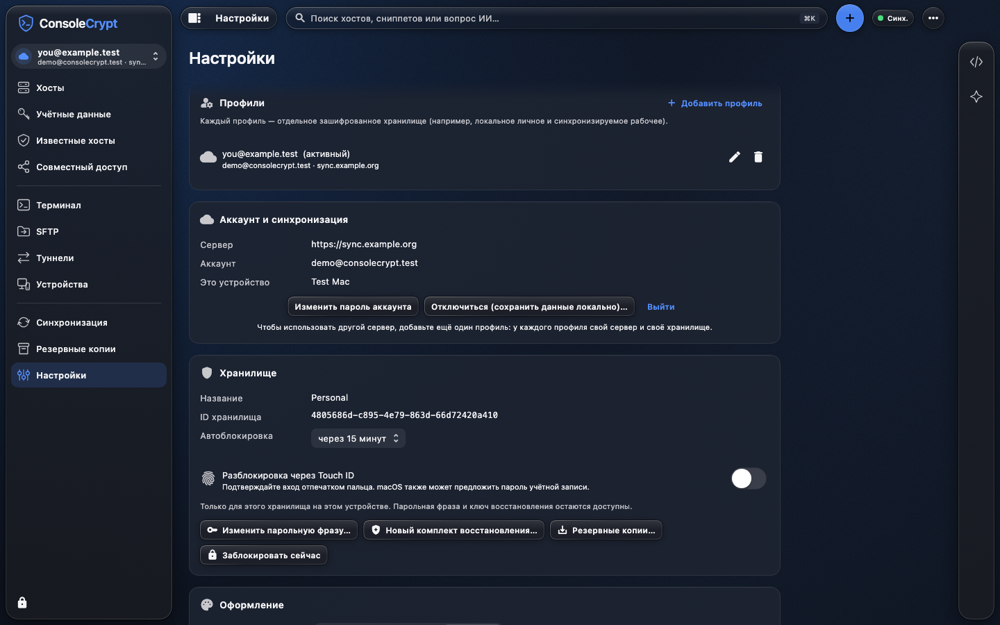

Настройки хранилища и доступные способы разблокировки; секреты на снимке не раскрыты.

<a name="devices"></a>

## 5. Синхронизация и доверенные устройства

Вход в аккаунт и право расшифровывать хранилище — разные действия. Новое устройство требует подтверждения.

1. На втором устройстве выберите тот же сервер и аккаунт. Если требуется доверие, откройте «Устройства» на уже доверенном устройстве.

2. Выберите ожидающее устройство, нажмите «Проверить и одобрить» и сверьте весь показанный код на обоих устройствах через независимый канал.

3. В разделе «Синхронизация» проверьте подключение, очередь изменений и конфликты. Изменения при отсутствии сети остаются локально и отправляются после восстановления связи.

4. Потерянное устройство отзовите в клиенте или веб-кабинете. Повторное подключение требует нового подтверждения.

> **Обратите внимание**
>
> Отзыв прекращает сеансы и будущую синхронизацию, но не стирает уже прочитанные данные и не меняет пароли на SSH-серверах. При компрометации замените соответствующие пароли и ключи на самих хостах.

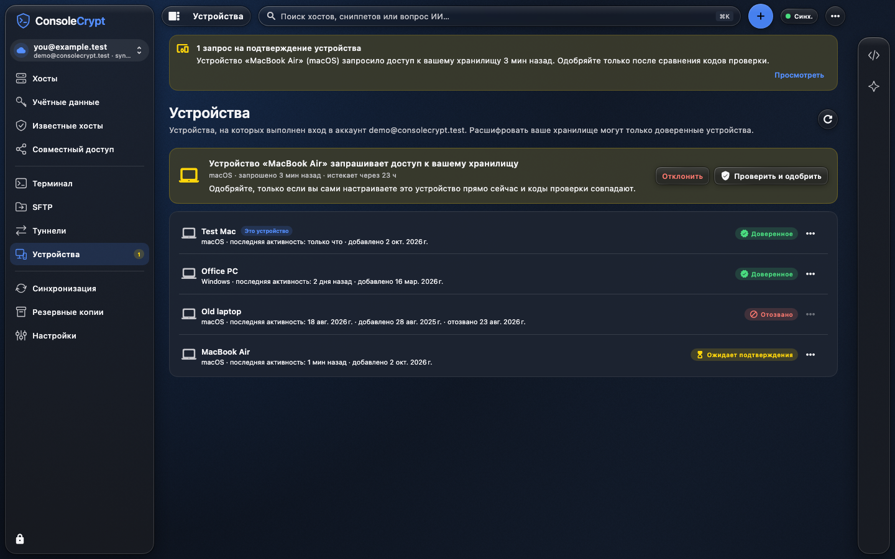

Список демонстрационных устройств; подтверждение доступа выполняется отдельно.

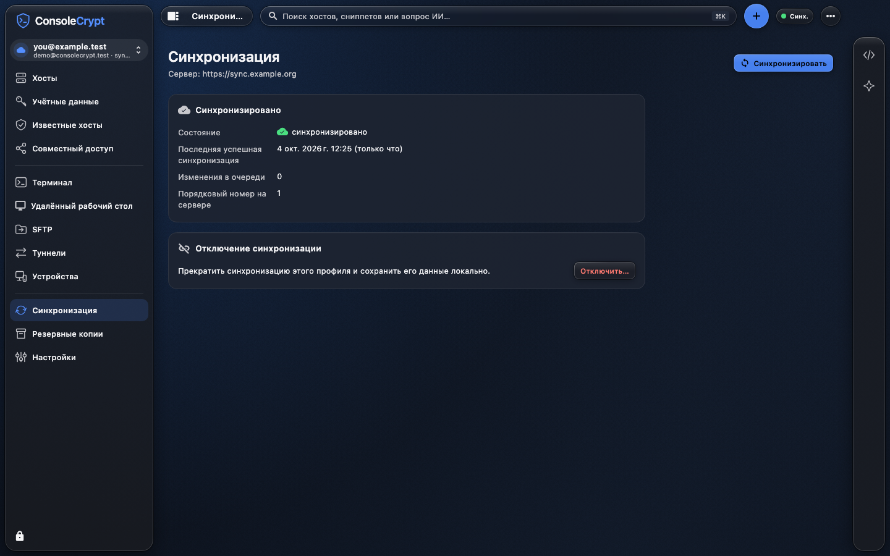

Состояние синхронизации и очередь демонстрационного профиля.

<a name="hosts"></a>

## 6. Хосты: добавить, найти, подключиться

Хост хранит параметры подключения по SSH или RDP. Карточки и список показывают адрес, пользователя и группу.

1. Откройте «Хосты → Новый хост» и сначала выберите SSH или RDP. Задайте имя, адрес, порт, пользователя и учётные данные. Для SSH доступны наследование из группы и jump-хосты; для RDP — пароль и необязательный домен Windows, порт по умолчанию 3389.

2. Используйте поиск по именам, адресам, группам и тегам. Переключатель карточки/список меняет представление; карточка группы открывает её содержимое.

3. Нажмите в центре карточки хоста или на значок подключения. В зависимости от типа откроется терминал или удалённый рабочий стол.

4. В меню «…» доступны подключение, SFTP, редактирование, удаление и добавление в существующую группу. Возможность поделиться показывается при поддержке сервером.


Обзор демонстрационных хостов и их параметров подключения.

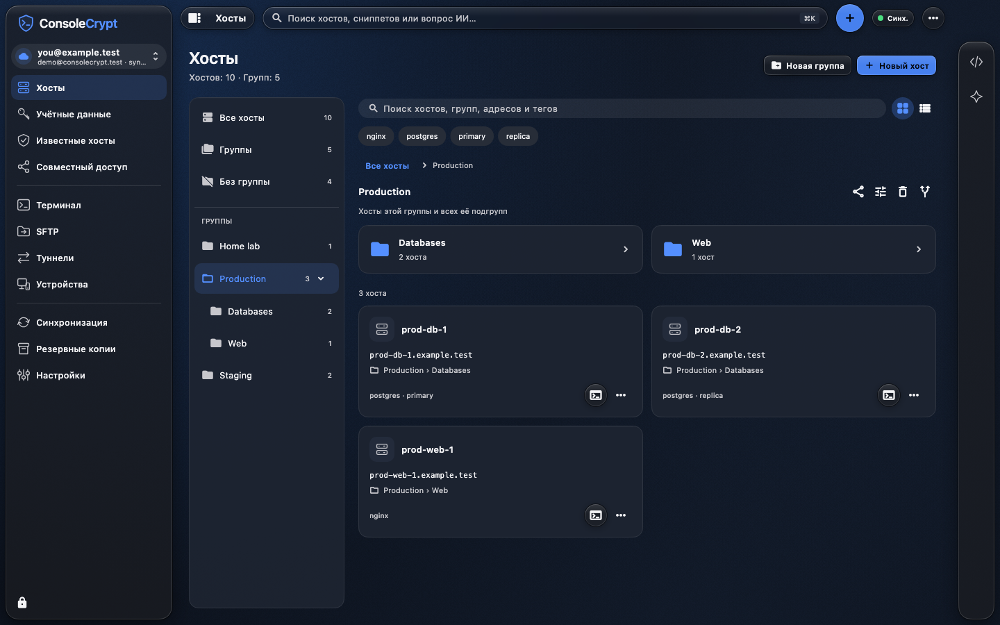

Хосты внутри демонстрационной группы: карточки, поиск и действия подключения.

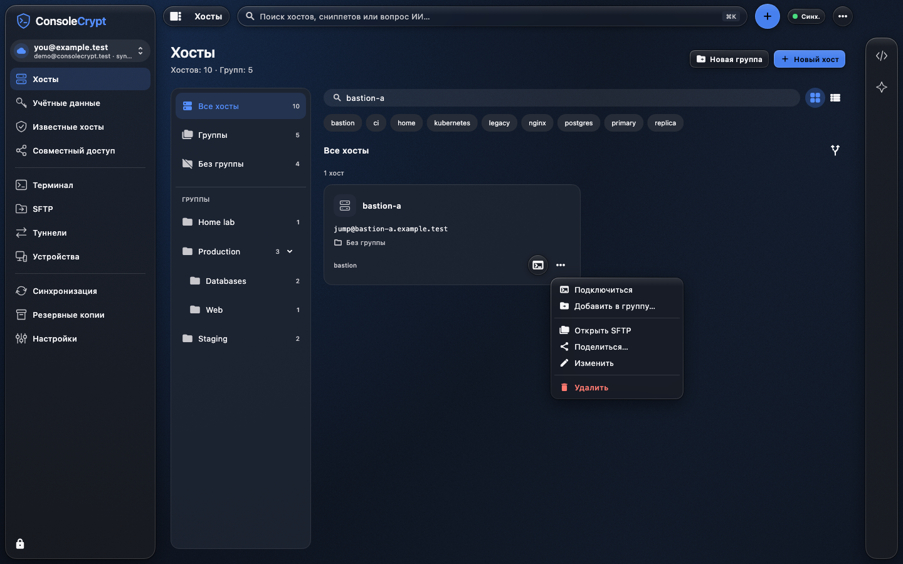

Меню действий выбранного хоста.

<a name="rdp"></a>

## 7. RDP: удалённый рабочий стол Windows

Добавлена возможность подключиться к RDP. ConsoleCrypt подключается напрямую к стандартному серверу Microsoft RDP; устанавливать дополнение IronRDP на Windows не нужно.

1. В «Хостах» создайте подключение типа RDP. Укажите адрес, пользователя Windows, пароль и, при необходимости, домен. Пароль можно сохранить в зашифрованном хранилище или вводить при каждом подключении. Настройки SSH-группы не применяются к RDP.

2. Перед подключением проверьте адрес, учётную запись и отпечаток сертификата. Сверьте отпечаток с администратором сервера. При изменении данных хоста подтверждение потребуется заново.

3. В разделе «Удалённый рабочий стол» нажмите кнопку подключения в центре или «+» рядом с вкладками и выберите сохранённый RDP-хост. Открытые рабочие столы находятся в панели вкладок. Переключайтесь между ними, открывайте новые и закрывайте ненужные. Одновременно доступны до четырёх RDP-сеансов.

4. Нажмите «Во весь экран»: рабочий стол займёт весь экран компьютера. Чтобы показать верхнюю панель, наведите указатель на синий индикатор у верхнего края или нажмите Ctrl+Alt+Home. Панель можно закрепить. В ней доступны переключение подключений, разрешения, сворачивание окна, возврат к обычному размеру и закрытие текущего сеанса. Escape передаётся удалённому компьютеру.

5. Включите обмен текстом для выбранного сеанса. Теперь Ctrl+V (⌘V на macOS) в активном рабочем столе передаёт локальный текст и вставляет его в Windows — предварительно нажимать «Отправить» не нужно. При выключенном обмене Ctrl+V использует буфер самой удалённой Windows.

6. Кнопка «Отправить» передаёт текст без вставки, а «Получить» запрашивает текст из Windows. Изменение локального буфера само по себе ничего не отправляет. Поддерживается текст до 64 КиБ; изображения и файлы через буфер не передаются.

7. На macOS, Windows и Linux выберите одну локальную папку в разрешениях сеанса. Дождитесь состояния «Папка подключена» и откройте ConsoleCrypt в разделе перенаправленных дисков Проводника Windows. По умолчанию разрешено только чтение; запись включается отдельно. Другие папки и диски компьютера не предоставляются.

8. Если папка не подключилась, проверьте политику перенаправления дисков на Windows-сервере. Рабочий стол продолжает работать независимо от доступа к папке. Замена папки прерывает операции с ранее открытыми файлами.

9. Обмен поддерживает файлы до 256 МиБ и суммарно до 512 МиБ попыток записи за сеанс. После достижения лимита переподключитесь. Символические ссылки, исходные отметки времени и блокировки файлов не переносятся.

10. Отключите разрешение на папку или буфер в панели сеанса, когда обмен закончен. Блокировка хранилища и выход закрывают соединения и отзывают временные разрешения.

> **Обратите внимание**
>
> Перед созданием RDP-хостов обновите все устройства рабочего пространства до версии 0.3 или новее. Старые клиенты не видят RDP-хосты, но могут изменить связанные учётные данные и группы. RDP-хосты синхронизируются между вашими устройствами с актуальной версией клиента. Передача RDP-хоста коллегам пока недоступна. На мобильных устройствах перенаправление папок недоступно. Доступность буфера и диска также зависит от политики Windows-сервера.

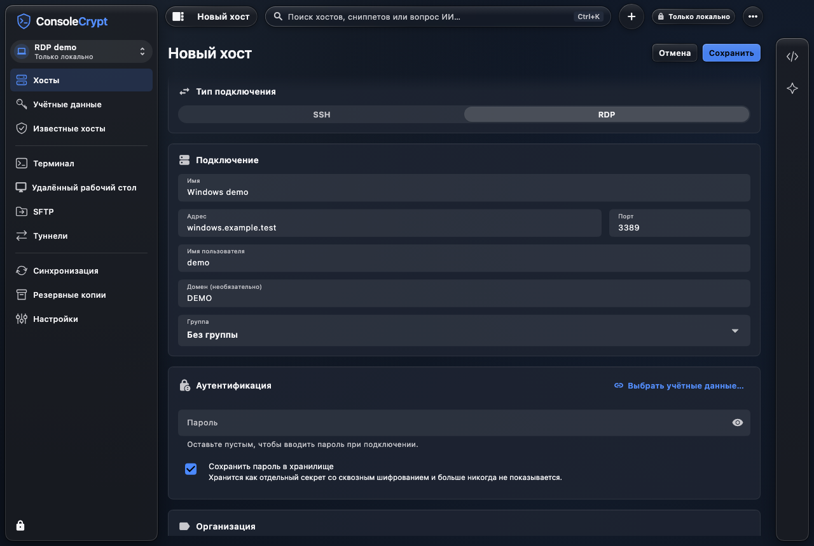

Создание RDP-хоста: отдельные поля Windows и сохранение пароля в хранилище. Демонстрационные данные.

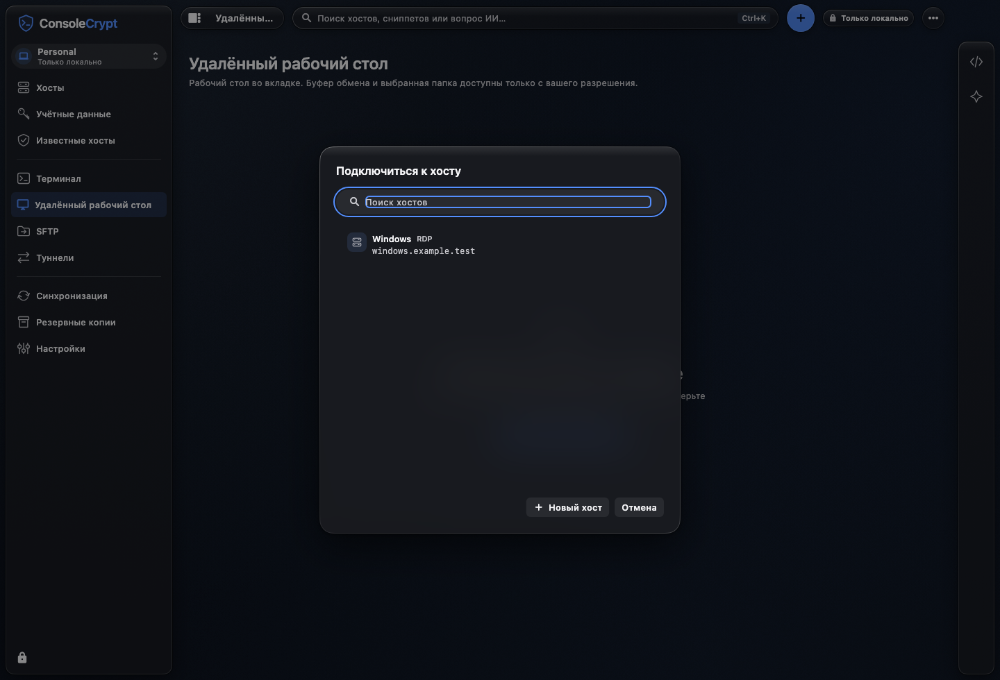

Выбор сохранённого RDP-хоста из раздела удалённого рабочего стола.

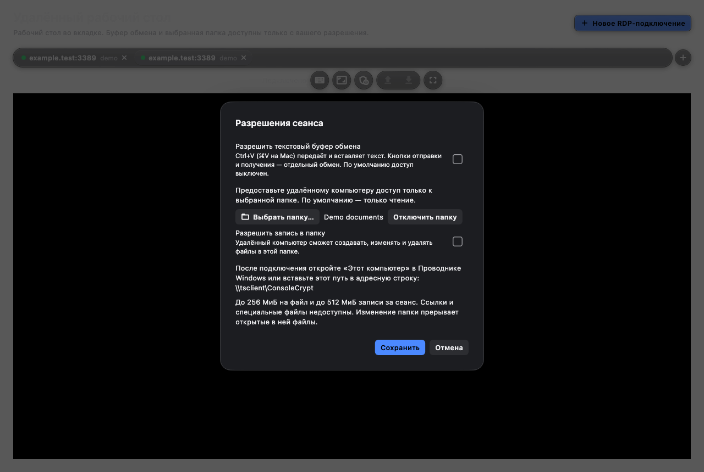

Разрешения демонстрационного сеанса: текстовый буфер и выбранная папка с отдельным правом записи. Рабочий стол Windows на снимке не отображается.


Панель полного экрана: переключение подключения, разрешения и управление окном. Демонстрационные данные.

<a name="quick-connect"></a>

## 8. Быстрый поиск и подключение

Найдите сохранённый хост из любой части приложения и сразу откройте SSH- или RDP-сеанс. Палитра команд объединяет поиск хостов, сниппетов и быстрые действия.

1. В верхней панели круглая кнопка «+» открывает список сохранённых SSH- и RDP-хостов. Найдите хост по имени или адресу и выберите его для подключения. Если нужного хоста ещё нет, нажмите «Новый хост». Поиск занимает свободное место между названием раздела и кнопкой «+»; справа отображается компактный статус «Синх.».

2. Нажмите ⌘K на macOS или Ctrl+K на Windows/Linux. Начните вводить имя хоста или его IP-адрес; поиск также учитывает адрес и имя пользователя в строке подключения.

3. Смотрите результаты в группе «Хосты». Под названием указаны параметры подключения: проверьте адрес, пользователя и порт перед выбором.

4. Выберите результат стрелками ↑ и ↓ и нажмите Enter либо щёлкните по строке. Приложение откроет SSH-терминал или RDP-сеанс в зависимости от типа хоста. При первом подключении проверьте ключ SSH или сертификат RDP.

5. Esc закрывает палитру. Если хост не найден, добавьте его в разделе «Хосты» и повторите поиск.

> **Обратите внимание**
>
> Поиск сохранённых хостов выполняется локально. Если введённое имя или IP-адрес не найдено, Enter не отправляет запрос ИИ. Для ИИ явно нажмите соответствующую строку или выберите её стрелками и подтвердите. Ввод адреса не создаёт новый хост.

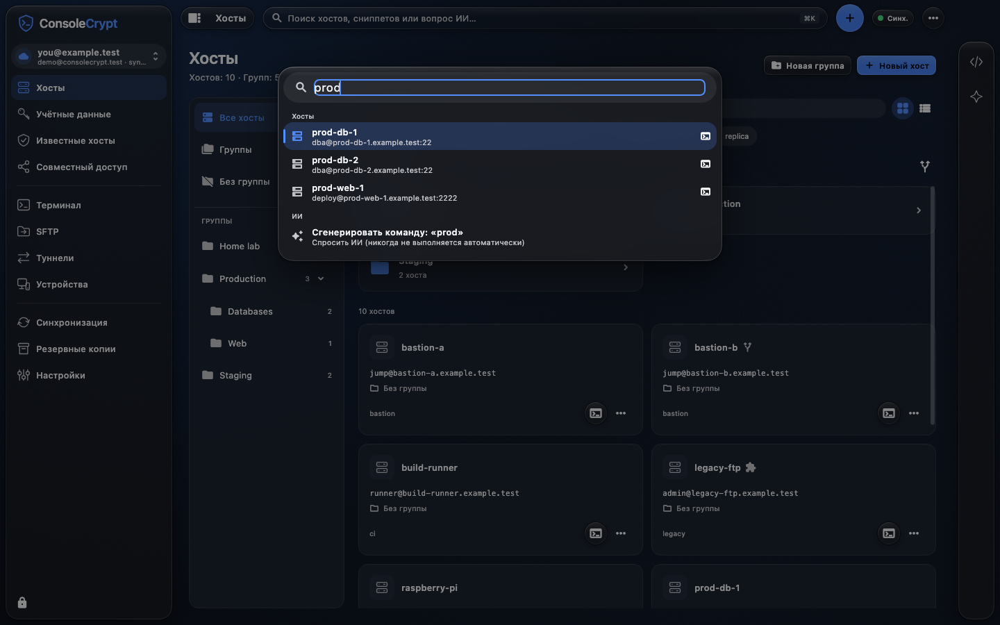

Локальный поиск сохранённых хостов в палитре команд.

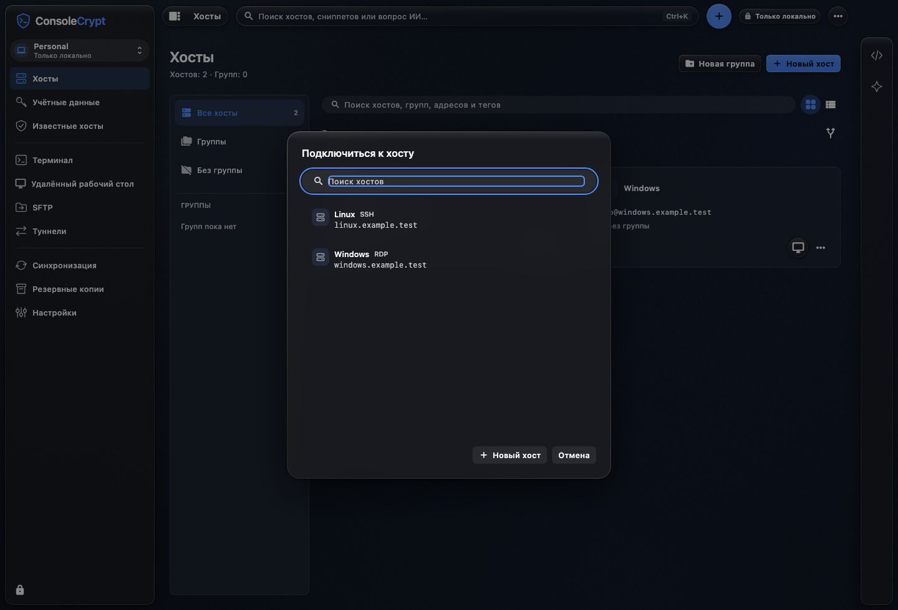

Общая кнопка «+»: выбор сохранённых SSH- и RDP-хостов.

<a name="groups"></a>

## 9. Группы и jump-хосты

Группы помогают ориентироваться и задавать общие параметры. Цепочка jump-хостов позволяет добраться до SSH-хоста через промежуточные узлы.

1. Откройте «Хосты» в левом меню и нажмите «Новая группа». Хосты и группы находятся в одном каталоге; для окружений и проектов можно создавать вложенные группы.

2. В настройках группы задайте общие имя пользователя, порт, учётные данные и профиль jump-хостов. Значение, заданное на хосте, имеет приоритет над наследованием.

3. В разделе профилей jump-хостов создайте профиль и выберите существующие хосты в нужном порядке. Назначьте профиль группе или отдельному хосту.

4. Перед перемещением или удалением группы проверьте итоговые унаследованные параметры: изменение родителя может изменить подключение.

> **Обратите внимание**
>
> SSH-соединения устанавливает клиент напрямую, включая jump-хосты. Сервер синхронизации не передаёт SSH-трафик. Личная группа и общая коллекция — разные объекты; правила общей коллекции описаны ниже.

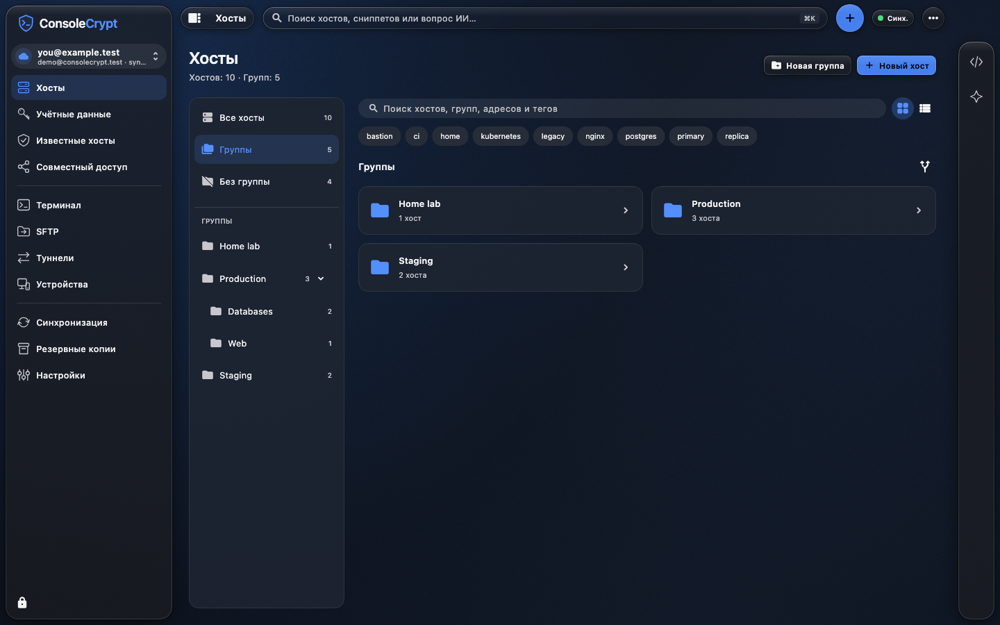

Демонстрационный каталог групп и навигация внутри рабочего пространства.

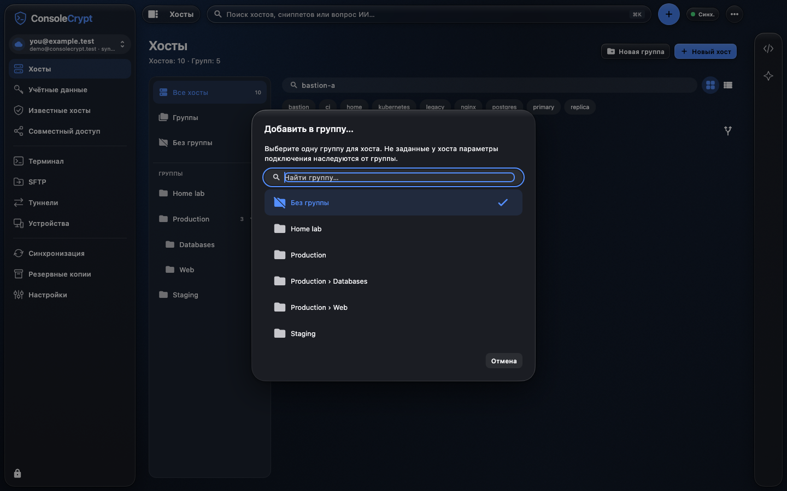

Добавление демонстрационного хоста в существующую группу.

<a name="credentials"></a>

## 10. Пароли, ключи и учётные данные

Учётные данные хранятся отдельно от хостов: один набор можно назначить нескольким подключениям.

1. В «Учётные данные → Новые учётные данные» добавьте пароль, создайте SSH-ключ или импортируйте поддерживаемый ключ. Доступные агенты и аппаратные методы зависят от платформы.

2. Укажите понятное название. Назначьте учётные данные хосту или группе; для ключа с парольной фразой заполните её отдельно.

3. Откройте карточку для просмотра метаданных и публичного ключа. Секрет появляется только после явного действия; копирование требует осторожности с буфером обмена.

4. Скопированный секрет очищается по выбранному таймеру, если буфер не был заменён другим значением. Изменение настройки действует на следующие копирования. Аварийное закрытие приложения и история системного буфера могут помешать удалению.

> **Обратите внимание**
>
> Не помещайте пароль или приватный ключ в название хоста, заметки или сниппет. Для передачи секрета коллеге используйте отдельный защищённый процесс «Поделиться», а не ИИ-чат.

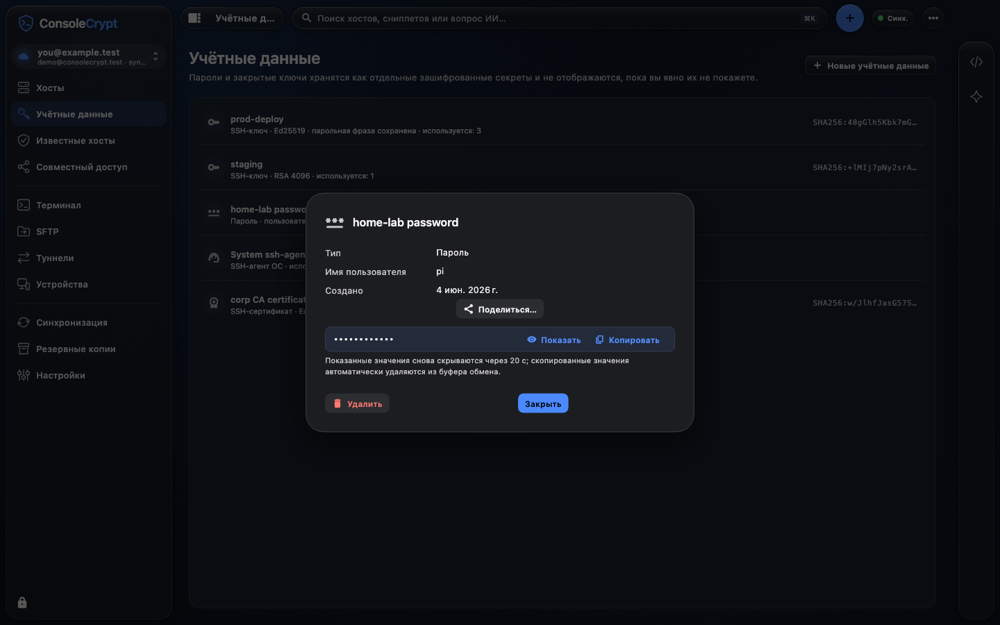

Учётные данные в демонстрационном хранилище; значения скрыты.

<a name="host-keys"></a>

## 11. Известные хосты и проверка SSH-ключа

Ключ сервера подтверждает, к какому SSH-хосту вы подключаетесь. Это отдельная проверка от доверия устройству ConsoleCrypt.

1. При первом подключении сверьте отпечаток ключа с администратором или доверенным источником и только затем примите его.

2. Сохранённые ключи находятся в отдельном боковом разделе «Известные хосты». Проверяйте адрес, алгоритм и отпечаток.

3. Если ключ изменился, подключение блокируется. Сначала выясните причину; удаляйте старую запись только после независимой проверки нового ключа.

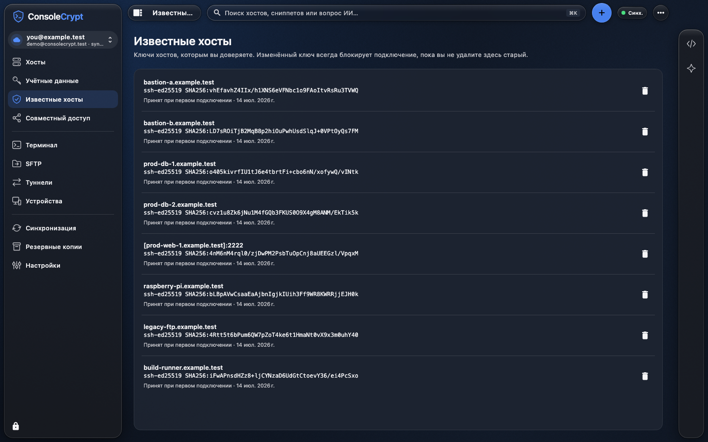

Отдельный список известных SSH-хостов с демонстрационными отпечатками.

<a name="terminal"></a>

## 12. Терминал, вкладки и выделение

Одна вкладка — одно SSH-подключение. На телефоне есть панель специальных клавиш, а на компьютере — горячие клавиши и контекстное меню.

1. Нажмите внутри терминала для ввода. Новое подключение открывается кнопкой «+». Когда вкладки не помещаются, прокручивайте полосу колёсиком или стрелками по краям. Рядом со стрелками показано общее число открытых вкладок в скобках.

2. Чтобы выделить несколько экранов вывода, удерживайте кнопку мыши и прокручивайте историю колёсиком. Можно вывести указатель за верхний или нижний край терминала: история начнёт прокручиваться автоматически, продолжая выделение.

3. Выделите текст и откройте меню правой кнопкой мыши. Доступны «Копировать», «Вставить», выделение всего, «Спросить ИИ» и сохранение выделенного в сниппет. Shift+F10 открывает меню с клавиатуры.

4. На телефоне используйте значок клавиатуры и «…» под терминалом. Рядом доступны Esc, Tab, Ctrl+C, Ctrl+D, Ctrl+L и стрелки; полоса прокручивается.

5. Многострочная вставка и управляющие символы требуют проверки. Проверьте хост и текст до подтверждения; команды после вставки выполняются по вашему действию.

6. При обрыве связи используйте переподключение в баннере вкладки. Буфер вывода сохраняется до закрытия вкладки; закрытие завершает эту сессию.

> **Обратите внимание**
>
> После обновления откройте новую SSH-сессию. Встроенный SSH запрашивает UTF-8 для ввода и удаления кириллицы. Если символы всё ещё искажаются, проверьте UTF-8 локаль удалённого хоста: настройки его оболочки и SSH-сервера могут перекрывать запрос клиента.

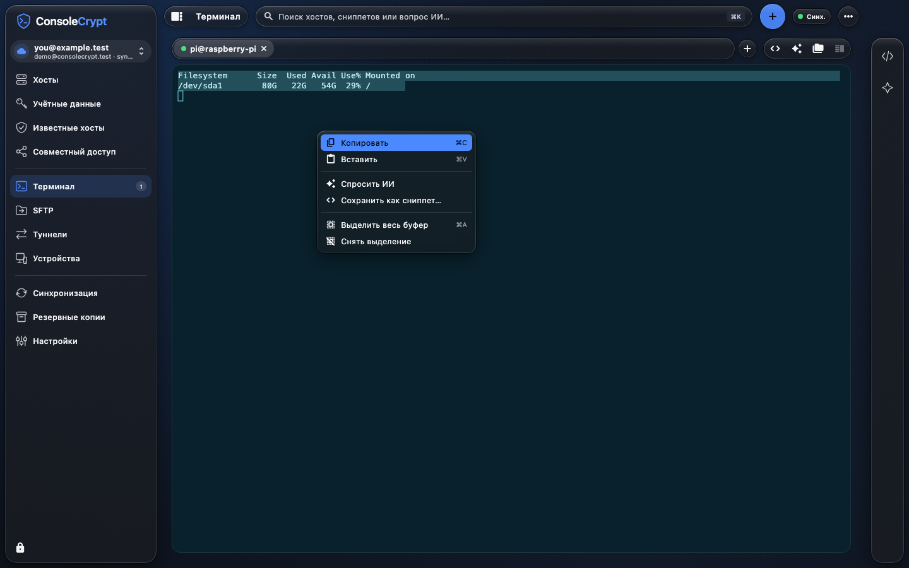

Контекстное меню над выделением в демонстрационном терминале.

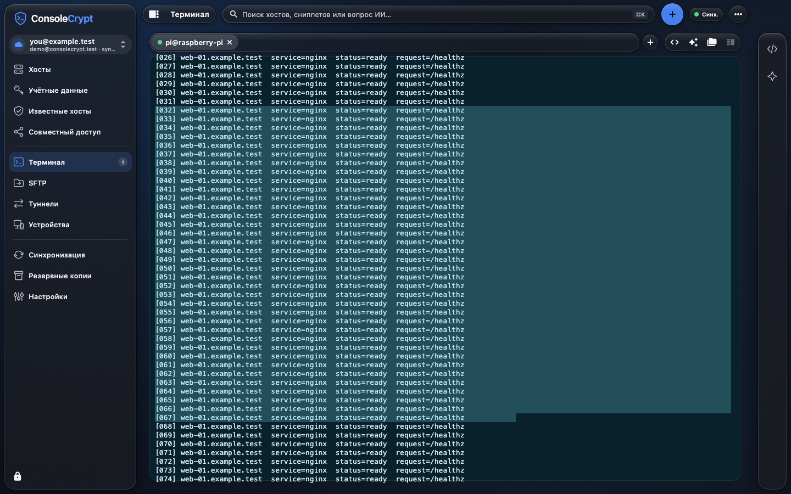

Выделение текста в середине истории демонстрационного терминала.

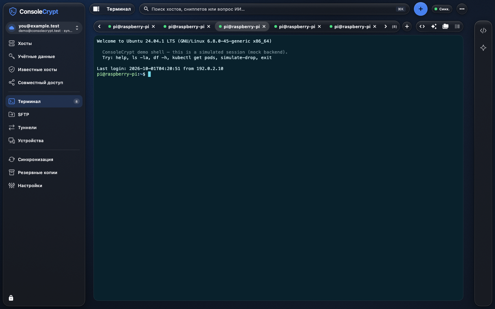

Восемь открытых демонстрационных вкладок: навигация по полосе и счётчик.

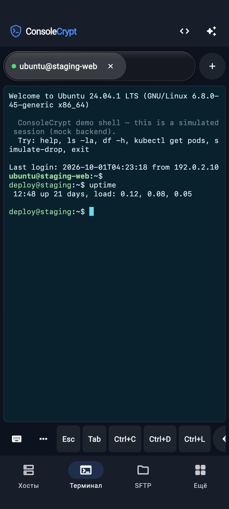

Демонстрационный терминал Android с панелью специальных клавиш.

<a name="shortcuts"></a>

## 13. Горячие клавиши

Основной модификатор — ⌘ на macOS и Ctrl на Windows/Linux. Копирование на Windows не занимает Ctrl+C: эта комбинация прерывает команду.

| Действие | macOS | Windows / Linux |
| --- | --- | --- |
| Найти хост, сниппет или действие | ⌘K | Ctrl+K |
| Новая вкладка SSH | ⌘T | Ctrl+T |
| Закрыть активную вкладку | ⌘W | Ctrl+W |
| Новый хост | ⌘N | Ctrl+N |
| Заблокировать хранилище | ⌘L | Ctrl+L |
| Настройки | ⌘, | Ctrl+, |
| Сниппеты | ⌘. | Ctrl+. |
| Копировать в терминале | ⌘C | Ctrl+Shift+C |
| Вставить в терминал | ⌘V | Ctrl+V; в Windows также Shift+Insert |

> **Обратите внимание**
>
> Комбинации приложения обрабатываются раньше терминала. Чтобы отправить Ctrl+L удалённой оболочке, на телефоне используйте одноимённую кнопку панели клавиш.

<a name="sftp"></a>

## 14. SFTP: передача и просмотр файлов

Откройте SFTP из меню хоста или бокового раздела. Файлы передаются непосредственно между вашим устройством и SSH-хостом.

1. Выберите хост и подключитесь. На компьютере используйте локальную и удалённую панели; на телефоне — переключение области и системный выбор файла.

2. Выделите файл и выберите загрузку или скачивание. Следите за передачами в панели активности; там отображаются ход выполнения и отмена.

3. Для чтения откройте «Быстрый просмотр». Номера строк находятся в отдельной колонке: при выделении и копировании текста они не попадают в буфер.

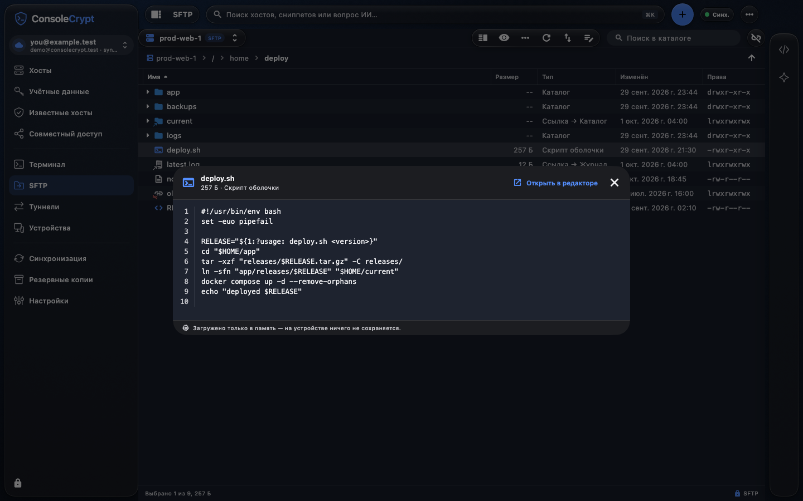

Быстрый просмотр демонстрационного файла с отдельной колонкой номеров строк.

<a name="sftp-editor"></a>

## 15. SFTP: редактор по умолчанию

На компьютере файл можно открыть во внешнем редакторе. ConsoleCrypt запоминает выбранную программу на этом устройстве.

1. В «Настройки → SFTP → Редактор по умолчанию» нажмите «Выбрать программу» и укажите установленный VS Code, Zed или другой редактор.

2. Действия «Открыть» и «Открыть в редакторе» используют этот выбор. «Открыть в программе…» позволяет выбрать другую программу для отдельного файла; «Системный редактор» сбрасывает настройку.

3. Прочитайте предупреждение перед первым открытием: рабочая копия хранится локально, а каждое сохранение загружается на удалённый сервер автоматически.

4. При изменении удалённого файла другим пользователем решите конфликт в панели редактирования. Завершите редактирование через ConsoleCrypt, чтобы закончить загрузку и удалить рабочую копию.

> **Обратите внимание**
>
> Автосохранение, резервные копии и облачные функции внешнего редактора находятся вне контроля ConsoleCrypt. Эта настройка предназначена для компьютеров; на мобильных платформах работа с файлами зависит от системных возможностей.

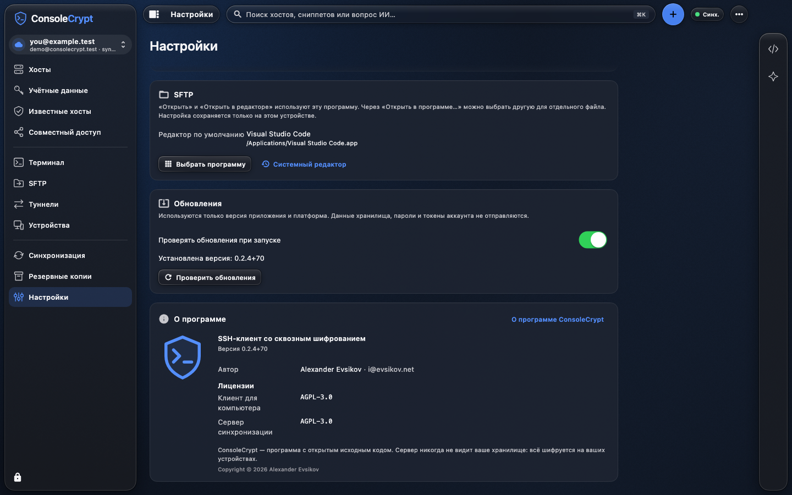

Локальная настройка запомненного редактора в демонстрационном клиенте.

<a name="tunnels"></a>

## 16. SSH-туннели

Туннель использует SSH-соединение к выбранному хосту. Есть локальное перенаправление, удалённое перенаправление и динамический SOCKS5.

1. Откройте «Туннели» и создайте туннель. Выберите хост, тип, адрес и порт прослушивания; для локального или удалённого типа задайте целевой адрес и порт.

2. Предпочитайте 127.0.0.1 для локального сервиса, который нужен только вам. Привязка к 0.0.0.0 может открыть порт другим устройствам сети.

3. Запустите туннель и проверьте его состояние. После завершения работы остановите его.

> **Обратите внимание**
>
> Определение туннеля может синхронизироваться вместе с хранилищем; запущенный туннель работает на конкретном устройстве. На телефоне работа в фоне зависит от ограничений ОС.

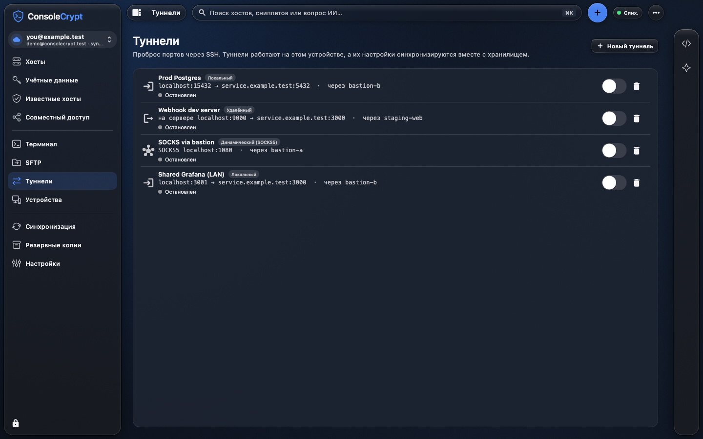

Демонстрационные определения туннелей и их состояния.

<a name="snippets"></a>

## 17. Сниппеты, переменные и базовые наборы

Сниппет — сохранённая команда или шаблон. Откройте инструмент значком &lt;/&gt; справа или горячей клавишей.

1. Нажмите «Новый сниппет», укажите имя, команду, тип, теги и при необходимости набор. В шаблоне используйте переменные вида {{service}}.

2. «Базовые наборы» предлагает «Диагностика Linux», Docker и Kubernetes. Добавляйте нужные наборы явно; команды становятся обычными объектами вашего хранилища.

3. Редактируйте, переносите в другой набор или удаляйте команды. Удаление набора удаляет его сниппеты после подтверждения и синхронизируется; примеры не возвращаются сами.

4. Перед использованием заполните переменные и проверьте итоговую команду. «Вставить» вставляет её в терминал; запуск на нескольких хостах требует выбора целей и отдельного подтверждения.

> **Обратите внимание**
>
> Изменения сниппетов синхронизируются в профиле с сервером. В локальном профиле они остаются локально. Полученный от коллеги сниппет также не выполняется автоматически.

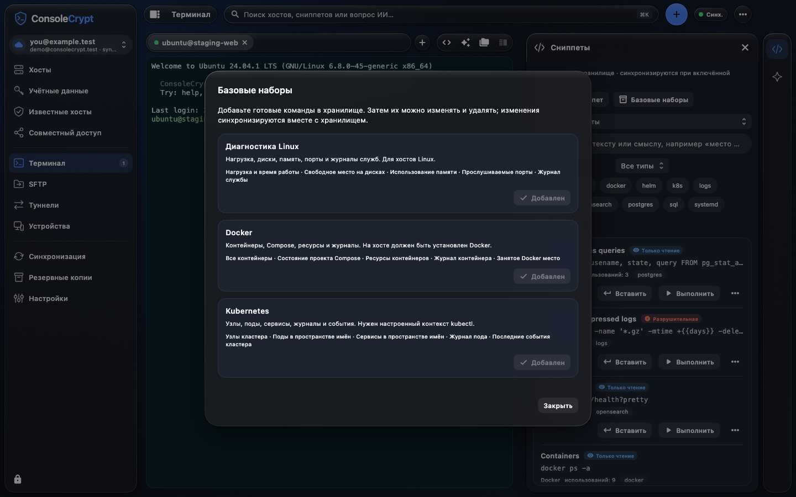

Три базовых набора в реальном интерфейсе с демонстрационными данными.

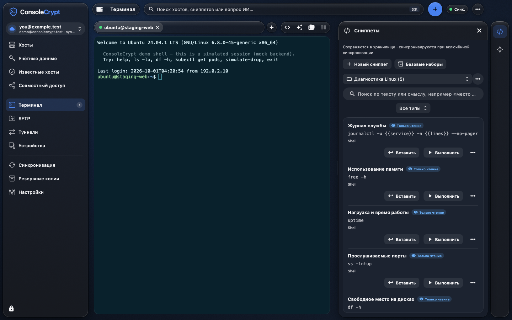

Фильтрация и управление наборами сниппетов.

<a name="ai"></a>

## 18. ИИ-чат и отправляемый контекст

Вы сами выбираете провайдера, контекст и последующее действие. Ответ модели не запускает команды.

1. В настройках ИИ добавьте локального или удалённого провайдера и выберите модель. Для удалённого провайдера проверьте адрес и его политику обработки данных.

2. «Строгий» профиль скрывает секреты, адреса, имена хостов, пользователей и БД. «Стандартный» сохраняет метаданные хостов; «Локальный» даёт больше контекста, продолжая скрывать секреты.

3. Выделите нужный текст терминала и выберите «Спросить ИИ» либо включите добавление выделения в чате. Проверьте контекст перед «Отправить»; не вставляйте секреты в свободный текст.

4. Перед «Вставить» или «Выполнить…» проверьте предложенную команду и целевой хост. Для исполнения приложение запрашивает подтверждение; оцените команду самостоятельно.

> **Обратите внимание**
>
> Подсистема ИИ не имеет API к парольной фразе и приватным ключам хранилища. Текущий чат хранится в памяти сессии: не рассчитывайте на сохранение или синхронизацию переписки. Блокировка хранилища или смена профиля очищает чат и отменяет текущий ответ; уже отправленный провайдеру контекст этим не удаляется.

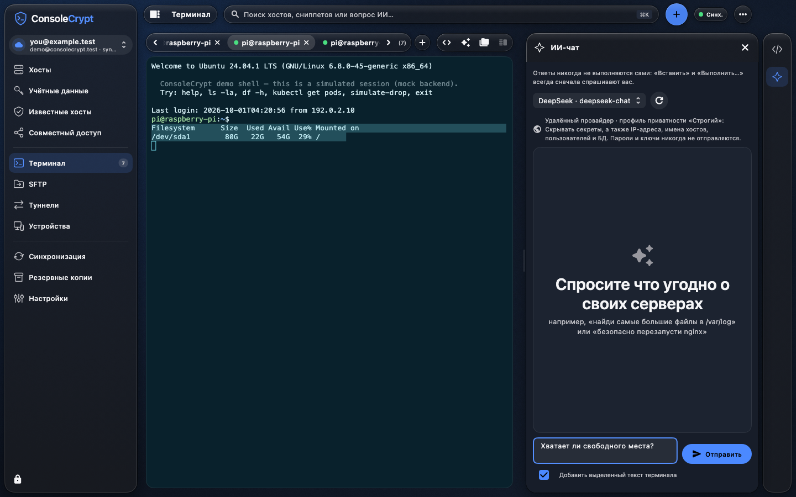

ИИ-чат с выбранным контекстом демонстрационного терминала.

<a name="sharing-start"></a>

## 19. Совместный доступ: с чего начать

Делитесь отдельными элементами с проверенными устройствами людей на том же сервере. Ваше личное хранилище и его ключ не передаются.

1. Откройте «Совместный доступ». Вкладки «Я поделился» и «Доступно мне» показывают созданные и полученные элементы. При недоступной функции проверьте поддержку и настройки сервера.

2. В карточке «Доступ на другом устройстве» собраны добавление этого устройства и подтверждение другого. «Запросы устройств» и «Другие действия» находятся ниже; вкладки со списками остаются над карточкой.

3. В меню хоста или сниппета выберите «Поделиться…». Просмотрите данные: хост передаётся без личных учётных данных; заметки требуют отдельного внимания.

4. Найдите устройства коллеги по email. Коллега открывает «Код моего устройства»; сравните весь код через независимый канал и отметьте подтверждение.

5. Оставьте «Чтение» для просмотра или явно выберите «Редактирование». Проверьте получателей и опубликуйте. Получатель сверяет код владельца в «Проверить и принять».

> **Обратите внимание**
>
> Доступность зависит от совместимого сервера, подтверждённой почты и доверия устройствам. На публичном consolecrypt.evsikov.net включены общий доступ, группы, секреты и подтверждённое добавление новых устройств коллеги. Каждый элемент публикуется только по явному действию его владельца.

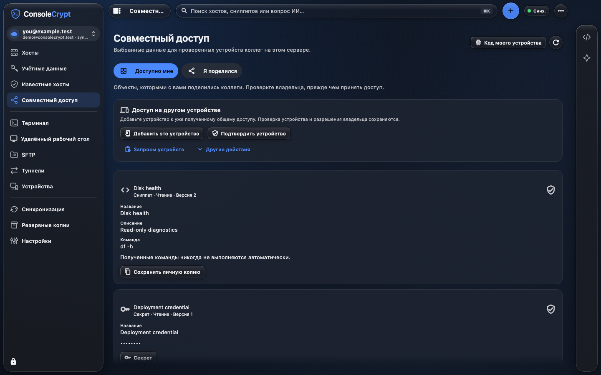

Совместный доступ: отдельная карточка устройств и синтетические элементы со скрытым секретом.

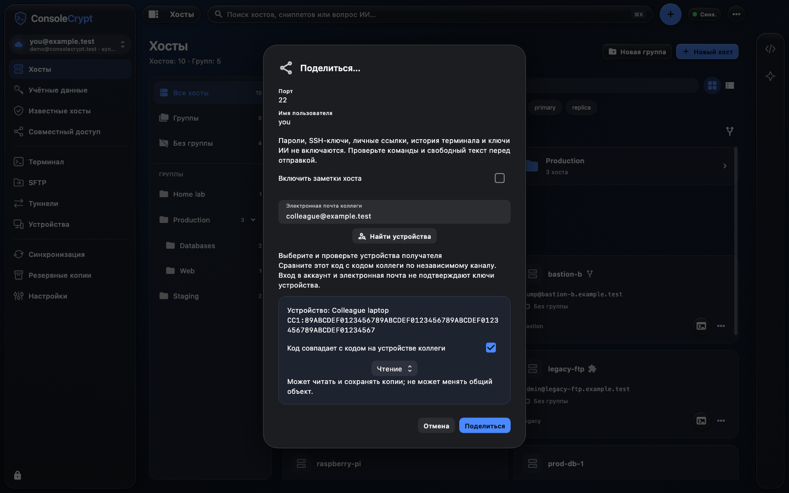

Полный пример кода устройства для независимой проверки; не используйте демонстрационный код для реального доверия.

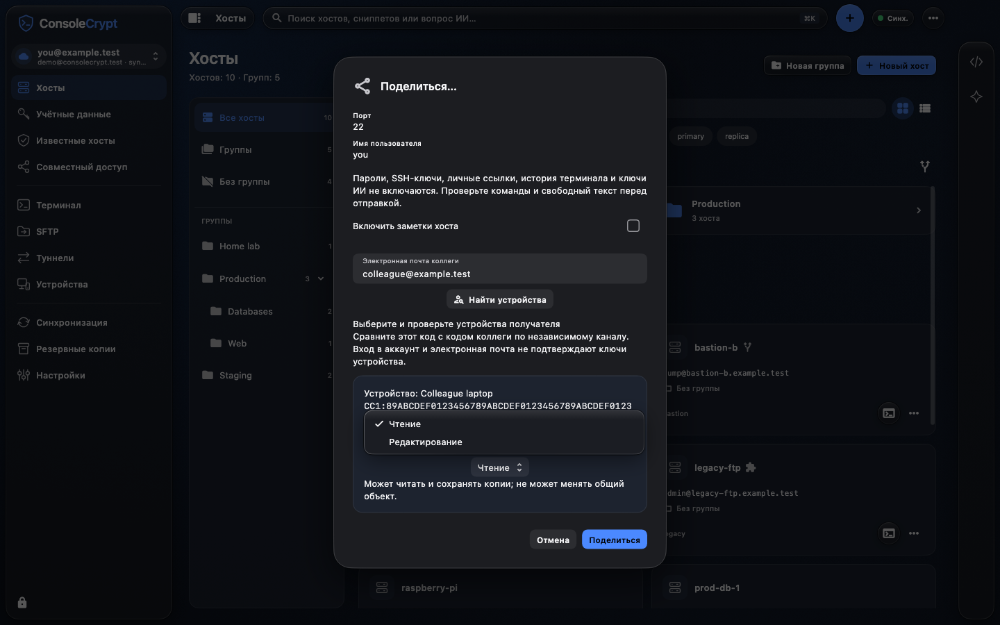

Выбор прав: чтение или редактирование.

<a name="sharing-items"></a>

## 20. Общие хосты, группы и секреты

Каждый элемент имеет собственный доступ. Группа не выдаёт права ко всем вложенным данным автоматически.

1. Для полученного хоста создайте личную копию и назначьте свои учётные данные. Перед новым адресом или портом требуется отдельная проверка, включая цепочку jump-хостов.

2. Публикуя группу, явно выберите ссылки на уже независимо опубликованные элементы. Получатель увидит недоступные вложения как закрытые; добавление личного хоста в группу само по себе ничего не публикует.

3. Секрет публикуется отдельно из карточки учётных данных, с явным предупреждением. Основной пароль или ключ и парольная фраза SSH-ключа — отдельные элементы; скрытый предпросмотр не раскрывает значение.

4. Получатель явно показывает секрет или копирует его после актуальной проверки доступа. Показ ограничен по времени; блокировка, смена профиля и закрытие диалога убирают раскрытое значение.

> **Обратите внимание**
>
> «Чтение» разрешает увидеть и сохранить доступные данные, включая отдельно выданный секрет. Оно не может запретить копирование уже прочитанного. Секреты не добавляются в обычный JSON хоста, сниппет или контекст ИИ.

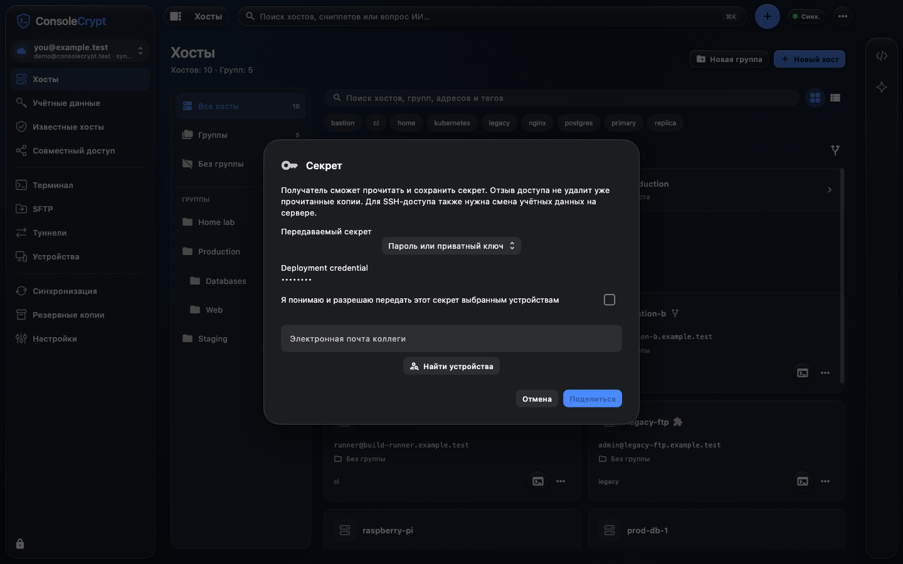

Отдельный диалог публикации секрета: значение скрыто, согласие ещё не дано.

<a name="sharing-devices"></a>

## 21. Новые собственные устройства коллеги

Разрешение касается только новых устройств уже проверенного коллеги. Оно не приглашает других людей и не повышает права.

1. Владелец элемента открывает «Новые собственные устройства», выбирает проверенное опорное устройство коллеги, предел прав, срок и число добавлений. По умолчанию используется ручное подтверждение; автоматическое включается явно.

2. Передайте публичный пакет разрешения новому устройству. В карточке «Доступ на другом устройстве» нажмите «Добавить это устройство»: оно проверяет пакет и создаёт запрос с правами чтения по умолчанию.

3. На уже проверенном устройстве коллеги нажмите «Подтвердить устройство», сравните полный код нового устройства и передайте подтверждённый пакет обратно.

4. Новое устройство продолжает добавление и отвечает на проверку владения ключом через «Запросы устройств». В ручном режиме владелец подтверждает запрос; автоматический действует только в заранее разрешённых пределах.

> **Обратите внимание**
>
> Для выполнения процесса владелец должен быть в сети с открытым хранилищем. В обоих режимах требуется полная сверка кода; импорт пакета сам по себе не выдаёт доступ. Публичный пакет содержит открытые ключи и подписи, а не слова восстановления или приватные ключи.

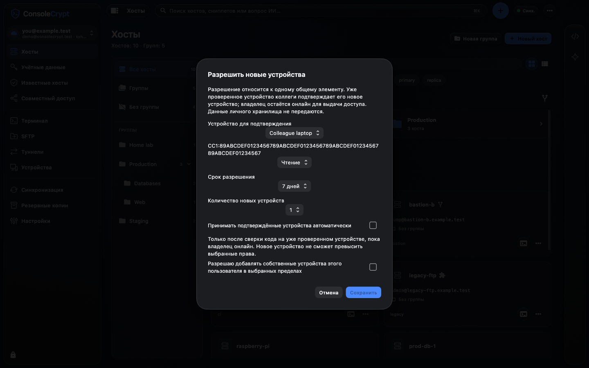

Настройка разрешения новых устройств: ручное подтверждение остаётся исходным вариантом.

<a name="sharing-revoke"></a>

## 22. Отзыв, очередь и восстановление доверия

Владелец управляет участниками. Редактор изменяет содержимое, а доступ участников остаётся под контролем владельца.

1. Откройте управление доступом элемента и отзовите нужное устройство. Для новых данных меняется ключ; ранее прочитанные копии остаются у получателя.

2. Чтобы остановить дальнейшее добавление устройств, отзовите разрешение новых устройств. Уже принятые устройства отзываются отдельно.

3. Проверьте очередь отправки: подписи и изменения, ожидающие сети, можно повторить явно. Удаление задания из очереди не отменяет уже опубликованное изменение.

4. При предупреждении об устаревшем состоянии используйте явное восстановление доверия с владельцем и сохранённым публичным пакетом. Не удаляйте системные ключи для обхода проверки.

> **Обратите внимание**
>
> Если секрет мог утечь, отзыв в ConsoleCrypt не заменяет смену пароля или SSH-ключа на целевом сервере. Ни ручное, ни автоматическое добавление устройств не стирает сохранённые получателем данные.

<a name="appearance"></a>

## 23. Цвета, размер текста и эффект стекла

Настройки внешнего вида сохраняются на этом устройстве. Размер текста интерфейса и шрифт терминала регулируются отдельно.

1. В «Настройки → Внешний вид» выберите системную, светлую или тёмную тему и уменьшите или увеличьте масштаб текста относительно базовых 100%.

2. Настройте акцент и фон через спектр или значение цвета; сброс возвращает исходную тему. В разделе терминала задайте его шрифт, размер и буфер прокрутки.

3. Для терминала выберите готовую палитру или «Настроить / импортировать…». Поддерживаются ConsoleCrypt JSON и цветовые пресеты iTerm; можно отдельно менять фон, текст, курсор, выделение и ANSI-цвета.

4. Переключите стекло: прозрачное, по умолчанию, тонированное или непрозрачное. Если эффекты упрощены, посмотрите сообщение о производительности и системные настройки прозрачности.

> **Обратите внимание**
>
> Окна безопасности остаются непрозрачными. Системное уменьшение прозрачности и режим производительности могут ограничить эффект; выбор палитры терминала не обязан менять интерфейс.

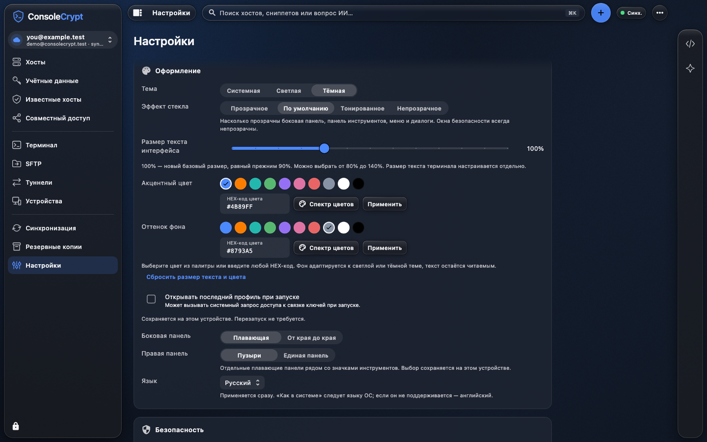

Настройки темы, масштаба и стекла демонстрационного интерфейса.

<a name="right-panel"></a>

## 24. Правая панель: пузыри или единая область

Сниппеты и ИИ находятся в правой панели инструментов. Выберите удобное поведение в настройках внешнего вида.

1. «Пузыри» открывает инструмент отдельной всплывающей карточкой. Кнопка закрытия убирает карточку.

2. «Единая панель» разворачивает общую рабочую область справа. На широком экране можно изменить её ширину и продолжать работу с терминалом рядом.

3. Закончив работу с инструментом, закройте его и щёлкните внутри активного терминала, чтобы продолжить ввод. Это возвращает ввод в SSH-сессию после работы с полями палитры или правой панели.

4. Переключайтесь между значками сниппетов и ИИ. На узком экране инструмент открывается поверх рабочей области, чтобы его элементы оставались доступными.

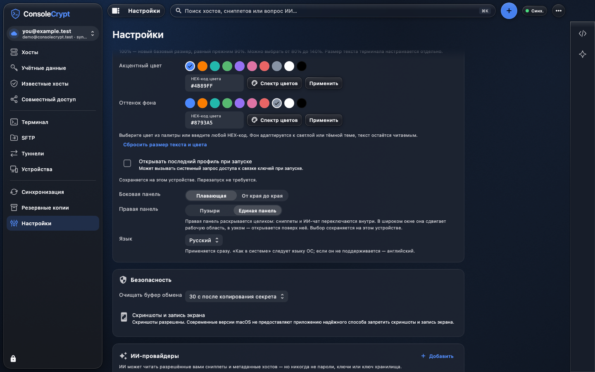

Два режима правой панели в настройках.

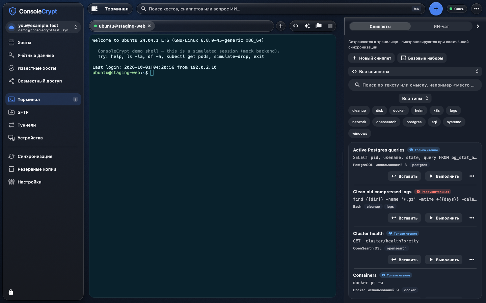

Развёрнутая панель сниппетов рядом с демонстрационным терминалом.

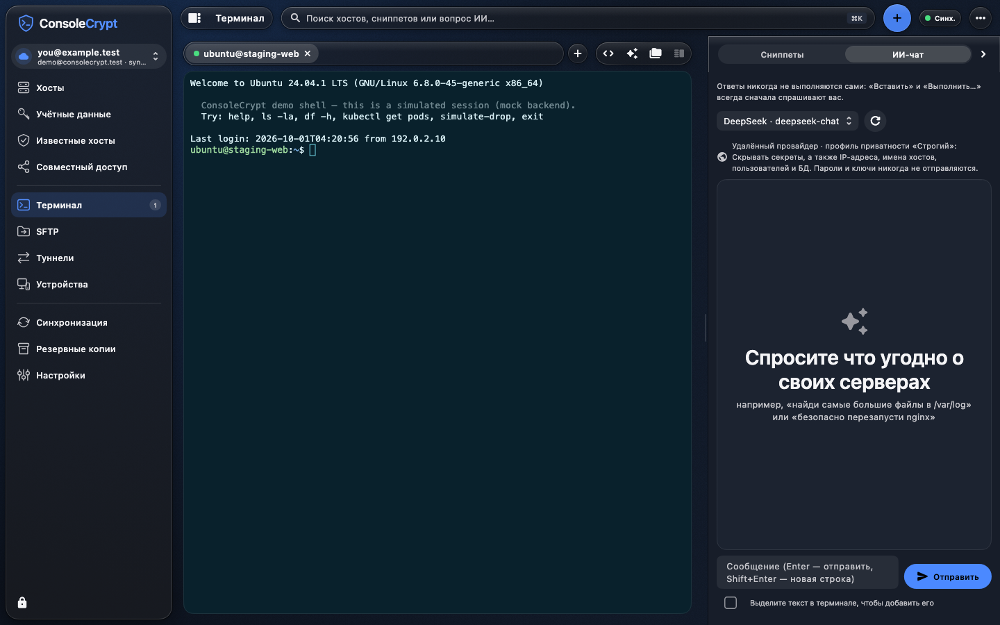

Развёрнутая панель ИИ рядом с демонстрационным терминалом.

<a name="screenshots"></a>

## 25. Скриншоты и защита экрана

Возможность запретить захват экрана зависит от ОС. Настройка разрешения сохраняется только на текущем устройстве.

| Платформа | Поведение |
| --- | --- |
| Android | В настройках безопасности включите «Разрешить скриншоты». По умолчанию захват запрещён; переключатель также влияет на запись экрана и превью недавних приложений. |
| macOS | Скриншоты разрешены. Современная macOS не даёт приложению надёжного способа полностью запретить скриншоты и запись; рабочего переключателя запрета нет. |
| iOS | Универсального запрета скриншотов нет. Превью приложения при уходе в фон закрывается защитной заставкой; физический iPhone проверяется отдельно. |

> **Обратите внимание**
>
> Не делайте снимки раскрытых секретов или комплекта восстановления. Все изображения этого руководства созданы на демонстрационных данных.

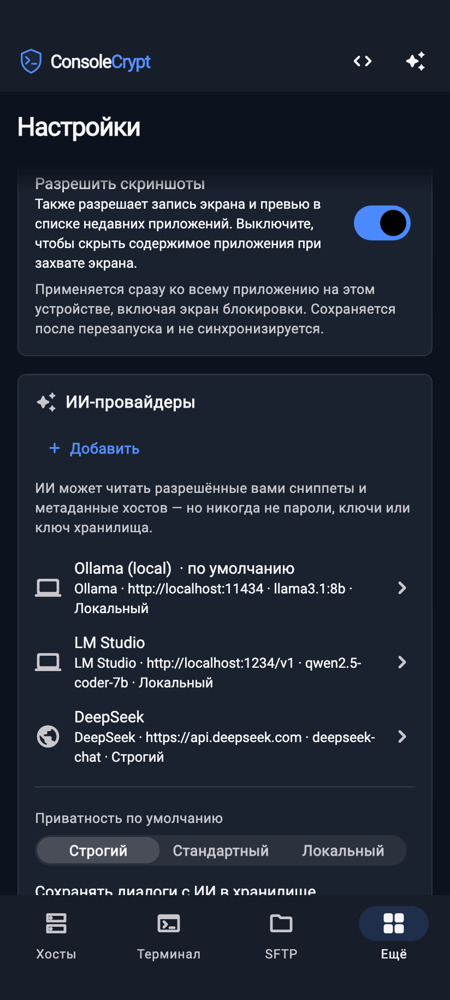

Переключатель разрешения скриншотов в демонстрационном интерфейсе Android; это снимок интерфейса, а не проверка захвата на физическом телефоне.

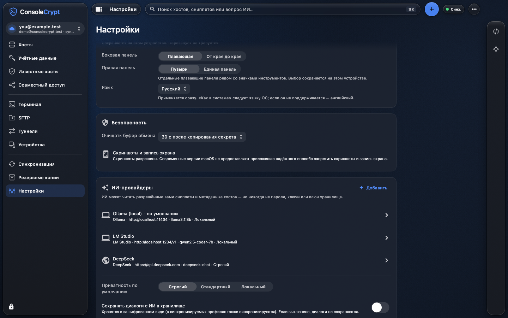

Раздел безопасности на macOS объясняет ограничение ОС.

<a name="backups"></a>

## 26. Резервные копии и восстановление

Синхронизация не заменяет резервную копию. Сохраняйте зашифрованный файл отдельно от устройства и комплект восстановления отдельно от файла.

1. В «Резервные копии» экспортируйте хранилище в файл .ccbackup. На компьютере можно настроить папку и расписание автоматических копий; мобильные возможности ограничены системным выбором файлов.

2. Для восстановления выберите файл на стартовом экране или в разделе резервных копий. Сначала проверьте информацию о копии.

3. Откройте копию парольной фразой либо комплектом восстановления и новой парольной фразой. Восстановление создаёт новый профиль.

> **Обратите внимание**
>
> При переносе на другой сервер не удаляйте исходный профиль до проверки восстановления. Локальные настройки редактора, внешнего вида и буфер терминала не становятся синхронизируемыми данными хранилища.

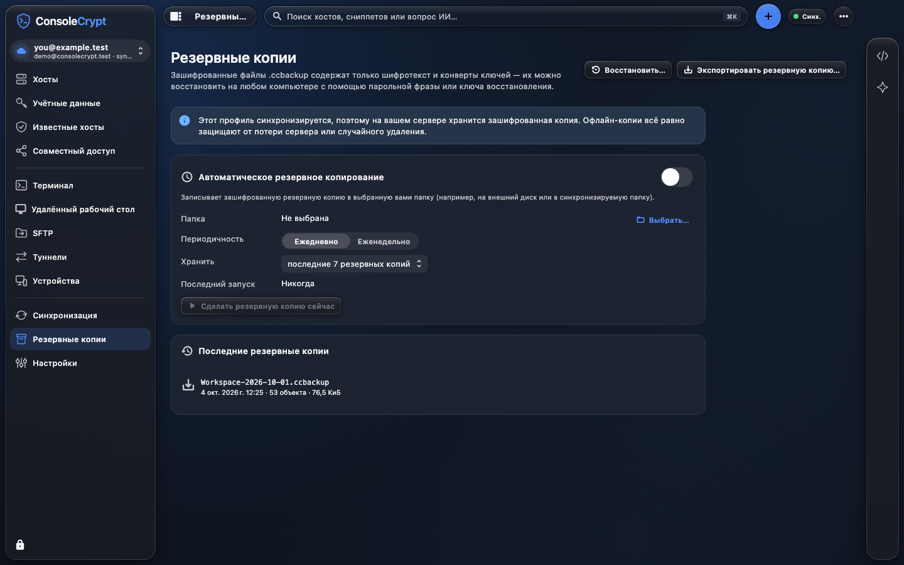

Зашифрованные резервные копии и расписание в демонстрационном клиенте.

<a name="about"></a>

## 27. Версия, автор и лицензии

В разделе «О программе» собраны сведения об установленном приложении: версия, номер сборки, автор и лицензии.

1. Откройте «Настройки → О программе». На macOS это окно также доступно из меню ConsoleCrypt.

2. При обращении в поддержку укажите версию и номер сборки из этого окна вместе с вашей операционной системой. Они помогают определить, какое обновление установлено.

3. Лицензии клиента и сервера показаны отдельно; в интерфейсе обе обозначены AGPL-3.0. Проверка новых версий находится в разделе «Обновления».

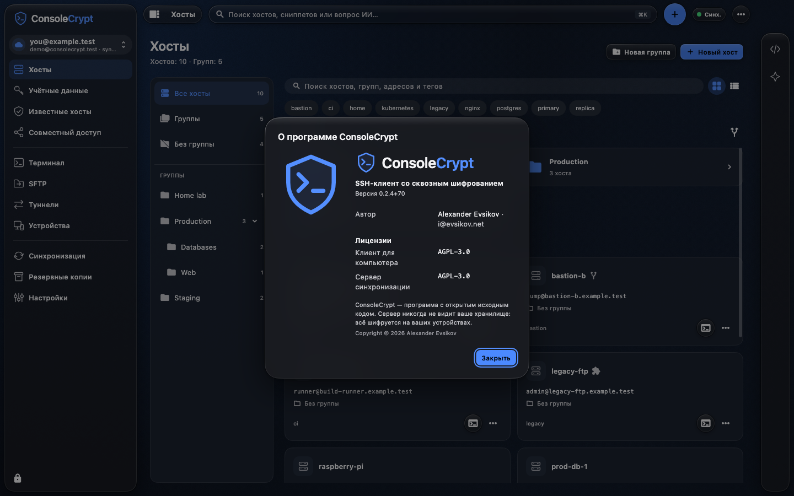

Окно «О программе»: версия, автор и обозначения лицензий клиента и сервера.

<a name="updates"></a>

## 28. Обновления клиента

На Windows, macOS и Android в «Настройки → Обновления» есть проверка при запуске и ручная проверка. Проверка не устанавливает обновление сама. На Linux новый пакет скачивается с сайта и устанавливается вручную.

1. Отключите автоматическую проверку, если хотите проверять вручную. Нажмите «Проверить обновления» и просмотрите новую версию и описание.

2. Сохраните резервную копию и завершите важные сессии перед установкой. При загрузке через приложение пакет проверяется по подписанным сведениям и контрольной сумме; установка требует вашего действия.

3. На Windows используется установщик, на Android — системная установка APK.

4. На Linux загрузите новый DEB или RPM со страницы «Скачать» и установите его вручную через пакетный менеджер. Инструкция находится в главе «Установка Linux».

5. В ConsoleCrypt 0.2.2 и новее на macOS после загрузки выберите новое имя или папку для DMG в системном диалоге «Сохранить и открыть». После открытия DMG завершите приложение, перенесите новую копию в Applications и подтвердите замену.

6. Отмена диалога оставляет проверенную загрузку для повторной попытки. Для сохранения выберите новое имя: существующий файл не перезаписывается.

[Полная инструкция обновления клиента ↗](../docs/public/UPDATES.md)

> **Обратите внимание**
>
> Если на macOS ConsoleCrypt не открывается после обновления через старое приложение, один раз скачайте актуальный DMG через браузер. Закройте ConsoleCrypt и замените его в Applications. Повторная загрузка через старую кнопку не устранит блокировку. Хранилище и связку ключей удалять не нужно. После первого запуска заменённой копии следующие обновления используют системный диалог «Сохранить и открыть».

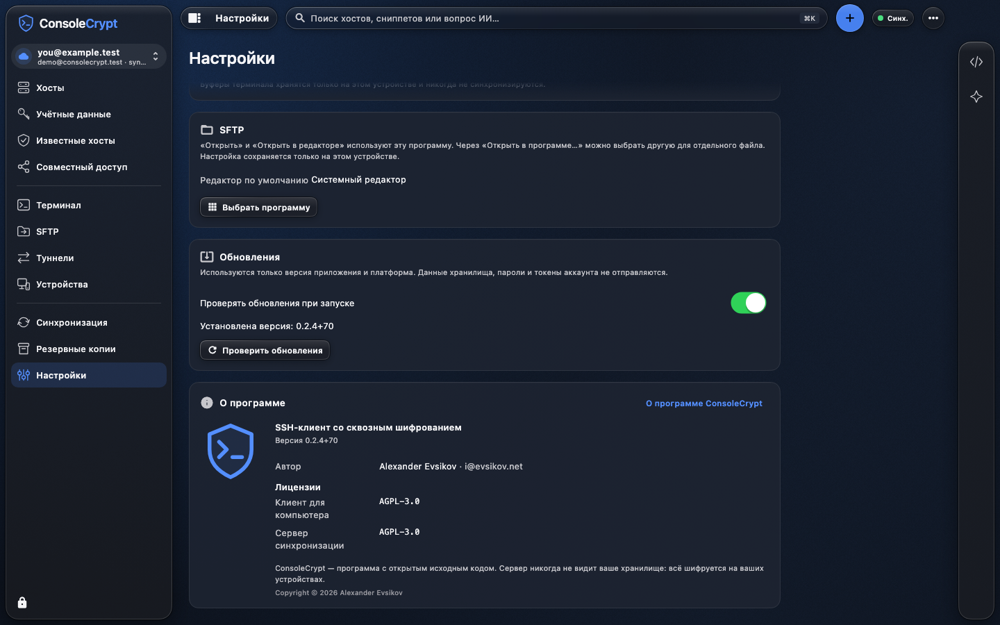

Проверка обновлений с отдельным переключателем проверки при запуске.

<a name="server-account"></a>

## 29. Личный кабинет

Веб-кабинет управляет аккаунтом публичного сервера. Работа с расшифрованными хостами, ключами и сниппетами остаётся в приложении.

1. Откройте «Личный кабинет» и используйте email и пароль аккаунта на consolecrypt.evsikov.net. Здесь можно подтвердить email, изменить пароль аккаунта и отозвать устройства.

2. Для закрытого контура разверните совместимый сервер из отдельной серверной части репозитория. Инструкции Docker и Helm предназначены для администратора.

3. В клиенте создайте профиль с HTTPS-адресом своего сервера. Зарегистрируйте аккаунт на нём; настройки почты, резервных копий сервера и доступности sharing задаёт администратор.

> **Обратите внимание**
>
> Сервер видит аккаунты и служебные метаданные, хранит зашифрованные объекты и не имеет ключа их расшифровки. Учётная запись другого сервера не переносится через вход в этот веб-кабинет.

<a name="server-setup"></a>

## 30. Свой сервер: Kubernetes

Сервер нужен для синхронизации устройств и совместной работы. Для локальной работы клиента он не требуется. Ни сайт продукта, ни аналитика для установки собственного сервера не нужны.

1. Подготовьте Kubernetes, Helm, PostgreSQL 16 и домен с HTTPS. Для небольшой установки можно использовать встроенную PostgreSQL из Helm chart; подробные варианты описаны в инструкции ниже.

2. Скачайте исходники. Храните kubeconfig, пароль базы и SMTP-пароль вне репозитория. Создайте namespace и Secret с URL вашей PostgreSQL из приватного файла.

3. Скопируйте пример Helm values в приватный каталог. Задайте адрес образа и его неизменяемый digest, свой домен, IngressClass, TLS и существующий Secret базы. Оставьте обязательные подписи запросов включёнными.

4. Проверьте values через helm lint и установите chart. Пример ниже рассчитан на внешний PostgreSQL и уже настроенный TLS Ingress; реальные домены и пути подставьте свои.

5. Проверьте /readyz и /v1/meta. В клиенте выберите подключение к серверу и укажите базовый HTTPS-адрес без /v1. Создайте аккаунт на этом сервере и проверьте синхронизацию на втором устройстве.

6. Для почты настройте SMTP с TLS и отдельным Secret. Для работы команды администратор отдельно включает поддержку общего доступа. Настройте резервные копии PostgreSQL и проверяйте восстановление до обновлений.

### 1. Исходники и Secret базы

Пример для sh/bash/zsh. Файл database-url содержит строку подключения вашей базы; команда читает его, не выводя содержимое.

```text
git clone https://git.evsikov.net/publics/consolecrypt.git
cd consolecrypt
git checkout --detach 8d2213f5bc24bd94a4eac6ee85f132ac3bd5600a
kubectl --kubeconfig /private/path/kubeconfig.yaml create namespace consolecrypt
kubectl --kubeconfig /private/path/kubeconfig.yaml -n consolecrypt create secret generic consolecrypt-database \
  --from-file=database-url=/private/path/database-url
```

### 2. Проверка и установка Helm chart

Сначала заполните приватный файл values.yaml по полной инструкции. Пример работает с Helm 3 и 4. Перед обновлением сохраните резервную копию базы: откат Helm не отменяет миграции.

```text
helm lint server/helm/consolecrypt-server -f /private/path/values.yaml
helm upgrade --install consolecrypt server/helm/consolecrypt-server \
  --namespace consolecrypt \
  --kubeconfig /private/path/kubeconfig.yaml \
  -f /private/path/values.yaml \
  --history-max 10 --wait --timeout 10m
```

### 3. Проверка работающего API

Используйте свой домен. /readyz подтверждает готовность базы, /v1/meta показывает версию и протокол сервера.

```text
curl --fail https://sync.example.com/readyz
curl --fail https://sync.example.com/v1/meta
```

[Полная инструкция: Docker, Helm, HTTPS, почта и резервные копии ↗](../docs/public/HOSTING.md)

> **Обратите внимание**
>
> Учётные записи разных серверов независимы. Сервер хранит зашифрованные данные и служебные метаданные, не расшифровывает хранилище и не участвует в SSH-соединениях. Не переносите действующие хранилища без резервной копии.


Подключение клиента: выберите сервер или начните работать локально.


Синхронизация: подключённый профиль, состояние и действия для проверки обмена данными.

<a name="server-docker"></a>

## 31. Свой сервер: Docker Compose

На одном Linux-сервере можно запустить ConsoleCrypt без Kubernetes: готовый образ сервера, PostgreSQL 16 и Caddy для HTTPS. База и сертификаты сохраняются в постоянных томах Docker.

1. Подготовьте Linux-сервер AMD64 или ARM64 с Docker Engine, Docker Compose v2, Git и Python 3. Укажите домен, направьте его DNS на сервер и освободите входящие TCP-порты 80 и 443 для HTTPS.

2. Скачайте пример и запустите генератор конфигурации. Он создаёт случайные пароли базы и приватный server.env вне репозитория, спрашивает настройки SMTP и отказывается перезаписывать существующий файл. Сохраняйте этот файл при обновлениях.

3. Проверьте конфигурацию и запустите профиль https. Compose загрузит готовый образ сервера, поднимет PostgreSQL и Caddy. Сборка Rust и Helm не нужны; миграции базы выполняются сервером при запуске.

4. Проверьте /readyz и /v1/meta по своему HTTPS-домену. PostgreSQL не публикует порт на хосте, а HTTP-порт API доступен только на 127.0.0.1. Клиенты подключаются через Caddy; не открывайте 8080 в интернет.

5. В клиенте выберите свой сервер и введите https://sync.example.com без /v1. Создайте учётную запись, проверьте доставку почты и синхронизацию двух устройств. Подтверждение email и включение совместного доступа описаны в полной инструкции.

6. Настройте резервные копии PostgreSQL и проверяйте восстановление. Перед обновлением сохраняйте базу, приватную конфигурацию и текущий digest образа. Перезапуск контейнеров сохраняет данные; удаление томов — нет.

### 1. Пример и приватная конфигурация

Команды для терминала Linux, Bash или zsh. Замените sync.example.com своим доменом. Генератор запрашивает пароль SMTP без отображения на экране.

```text
git clone --depth 1 https://git.evsikov.net/publics/consolecrypt.git consolecrypt-server-docker
cd consolecrypt-server-docker
export CC_INSTALL_DIR="$HOME/.config/consolecrypt-docker"
export CC_API_DOMAIN="sync.example.com"
python3 server/deploy/docker/init-config.py \
  --directory "$CC_INSTALL_DIR" --domain "$CC_API_DOMAIN"
```

### 2. Запуск с HTTPS

В том же терминале определите помощник cc\_compose. config --quiet проверяет файл без вывода паролей; Caddy получает сертификат для указанного домена.

```text
cc_compose() {
  docker compose --env-file "$CC_INSTALL_DIR/server.env" \
    -f server/deploy/docker/compose.yaml --profile https "$@"
}
cc_compose config --quiet
cc_compose pull
cc_compose up -d --wait --wait-timeout 180
cc_compose ps
```

### 3. Проверка и подключение клиента

Ожидаются HTTP 200, ready в /readyz и JSON с версией в /v1/meta. Для клиента используйте этот же домен с https://. Если сертификат ещё не получен, проверьте DNS, порты и журнал Caddy по полной инструкции.

```text
curl --fail "https://$CC_API_DOMAIN/readyz"
curl --fail "https://$CC_API_DOMAIN/v1/meta"
```

[Полная инструкция Docker: HTTPS, SMTP, резервные копии и обновления ↗](../docs/public/HOSTING.md#docker-compose)

[Настройки SMTP и установка без Docker: приватный файл конфигурации ↗](https://git.evsikov.net/publics/consolecrypt/-/blob/main/server/deploy/native/README.md)

> **Обратите внимание**
>
> Этот Compose запускает сервер синхронизации. Он не расшифровывает хранилища и не передаёт SSH-трафик. Приватный server.env содержит пароли: не публикуйте его и не прикладывайте к отчётам. Не запускайте генератор заново для существующей базы. Для смены SMTP измените server.env и пересоздайте контейнер сервера; пересборка образа не нужна.


В клиенте выберите свой сервер и укажите его HTTPS-адрес.
